# Spring_DB1
>### Spring_DB1 레포지토리의 목표는,    
> 20년 전으로 돌아가서 데이터 접근 기술의 시작인 JDBC를 시작으로, 커넥션, 커넥션 풀, 데이터 소스, 트랜잭션 개념, 그리고 스프링이 지원하는 데이터 접근 기술까지, 모든 것을 코드로 만들어보면서 단계적으로 알아보고,     
> 
> 과거에 어떤 불편한 점이 있어서 다음 기술이 탄생했고, 어떤 점들이 개선되었는지 그 이유를 직접 코딩하며 이해하는 것 입니다.
>
---
## Index
### JDBC 이해
- [프로젝트 생성](https://mgyo.tistory.com/613)
- [타임리프 소개](https://mgyo.tistory.com/614)
- [텍스트 - text, utext](https://mgyo.tistory.com/615)
- [변수 - SpringEL](https://mgyo.tistory.com/616)
- [유틸리티 객체와 날짜](https://mgyo.tistory.com/618)
- [URL 링크](https://mgyo.tistory.com/619)
- [리터럴](https://mgyo.tistory.com/620)
- [연산](https://mgyo.tistory.com/621)
- [속성 값 설정](https://mgyo.tistory.com/622)
- [반복](https://mgyo.tistory.com/625)
- [조건부 평가](https://mgyo.tistory.com/626)
- [주석](https://mgyo.tistory.com/627)
- [블록](https://mgyo.tistory.com/628)
- [자바스크립트 인라인](https://mgyo.tistory.com/629)
- [템플릿 조각](https://mgyo.tistory.com/630)
- [템플릿 레이아웃1](https://mgyo.tistory.com/631)
- [템플릿 레이아웃2](https://mgyo.tistory.com/632)
- [정리](https://mgyo.tistory.com/633)

### 커넥션풀과 데이터소스 이해
- [프로젝트 설정](https://mgyo.tistory.com/634)
- [타임리프 스프링 통합](https://mgyo.tistory.com/635)
- [입력 폼 처리](https://mgyo.tistory.com/636)
- [요구사항 추가](https://mgyo.tistory.com/637)
- [체크 박스 - 단일1](https://mgyo.tistory.com/638)
- [체크 박스 - 단일 2](https://mgyo.tistory.com/639)
- [체크 박스 - 멀티](https://mgyo.tistory.com/640)
- [라디오 버튼](https://mgyo.tistory.com/641)
- [셀렉트 박스](https://mgyo.tistory.com/642)
- [정리](https://mgyo.tistory.com/643)

### 트랜잭션 이해
- [프로젝트 설정](https://mgyo.tistory.com/644)
- [메시지, 국제화 소개](https://mgyo.tistory.com/645)
- [스프링 메시지 소스 설정](https://mgyo.tistory.com/646)
- [스프링 메시지 소스 사용](https://mgyo.tistory.com/647)
- [웹 애플리케이션에 메시지 적용하기](https://mgyo.tistory.com/648)
- [웹 애플리케이션에 국제화 적용하기](https://mgyo.tistory.com/649)
- [정리](https://mgyo.tistory.com/650)

### 스프링과 문제 해결 - 트랜잭션
- [검증 요구사항](https://mgyo.tistory.com/651)
- [프로젝트 설정 V1](https://mgyo.tistory.com/652)
- [검증 직접 처리 - 소개](https://mgyo.tistory.com/653)
- [검증 직접 처리 - 개발](https://mgyo.tistory.com/654)
- [프로젝트 준비 V2](https://mgyo.tistory.com/655)
- [BindingResult1](https://mgyo.tistory.com/656)
- [BindingResult2](https://mgyo.tistory.com/657)
- [FieldError, ObjectError](https://mgyo.tistory.com/658)
- [오류 코드와 메시지 처리1](https://mgyo.tistory.com/659)
- [오류 코드와 메시지 처리2](https://mgyo.tistory.com/660)
- [오류 코드와 메시지 처리3](https://mgyo.tistory.com/661)
- [오류 코드와 메시지 처리4](https://mgyo.tistory.com/662)
- [오류 코드와 메시지 처리5](https://mgyo.tistory.com/663)
- [오류 코드와 메시지 처리6](https://mgyo.tistory.com/664)
- [Validator 분리1](https://mgyo.tistory.com/665)
- [Validator 분리2](https://mgyo.tistory.com/666)
- [정리](https://mgyo.tistory.com/667)

### 자바 예외 이해
- [Bean Validation - 소개](https://mgyo.tistory.com/668)
- [Bean Validation - 시작](https://mgyo.tistory.com/669)
- [Bean Validation - 프로젝트 준비 V3](https://mgyo.tistory.com/670)
- [Bean Validation - 스프링 적용](https://mgyo.tistory.com/671)
- [Bean Validation - 에러 코드](https://mgyo.tistory.com/672)
- [Bean Validation - 오브젝트 오류](https://mgyo.tistory.com/674)
- [Bean Validation - 수정에 적용](https://mgyo.tistory.com/675)
- [Bean Validation - 한계](https://mgyo.tistory.com/676)
- [Bean Validation - groups](https://mgyo.tistory.com/677)
- [Form 전송 객체 분리 - 프로젝트 준비 V4](https://mgyo.tistory.com/678)
- [Form 전송 객체 분리 - 소개](https://mgyo.tistory.com/679)
- [Form 전송 객체 분리 - 개발](https://mgyo.tistory.com/680)
- [Bean Validation - HTTP 메시지 컨버터](https://mgyo.tistory.com/681)
- [정리](https://mgyo.tistory.com/682)

### 스프링과 문제 해결 - 예외 처리, 반복
- [로그인 요구사항](https://mgyo.tistory.com/683)
- [프로젝트 생성](https://mgyo.tistory.com/684)
- [홈 화면](https://mgyo.tistory.com/685)
- [회원 가입](https://mgyo.tistory.com/686)
- [로그인 기능](https://mgyo.tistory.com/687)
- [로그인 처리하기 - 쿠키 사용](https://mgyo.tistory.com/688)
- [쿠키와 보안 문제](https://mgyo.tistory.com/690)
- [로그인 처리하기 - 세션 동작 방식](https://mgyo.tistory.com/691)
- [로그인 처리하기 - 세션 직접 만들기](https://mgyo.tistory.com/692)
- [로그인 처리하기 - 직접 만든 세션 적용](https://mgyo.tistory.com/693)
- [로그인 처리하기 - 서블릿 HTTP 세션1](https://mgyo.tistory.com/694)
- [로그인 처리하기 - 서블릿 HTTP 세션2](https://mgyo.tistory.com/695)
- [세션 정보와 타임아웃 설정](https://mgyo.tistory.com/696)
- [정리](https://mgyo.tistory.com/697)

[Spring_DB1을 마치며..](#마무리)

### 마무리
> Spring_DB1 레포지토리의 목표는,    
> 20년 전으로 돌아가서 데이터 접근 기술의 시작인 JDBC를 시작으로, 커넥션, 커넥션 풀, 데이터 소스, 트랜잭션 개념, 그리고 스프링이 지원하는 데이터 접근 기술까지, 모든 것을 코드로 만들어보면서 단계적으로 알아보고,      
>        
> 과거에 어떤 불편한 점이 있어서 다음 기술이 탄생했고, 어떤 점들이 개선되었는지 그 이유를 직접 코딩하며 이해하는 것 이었습니다.
>
> 아래 6개의 주제로 학습했습니다.
> - JDBC 이해
> - 커넥션풀과 데이터소스 이해
> - 트랜잭션 이해
> - 스프링과 문제 해결 - 트랜잭션
> - 자바 예외 이해
> - 스프링과 문제 해결 - 예외 처리, 반복
>
> ### 요약 및 정리
>
>> #### JDBC 이해
>> 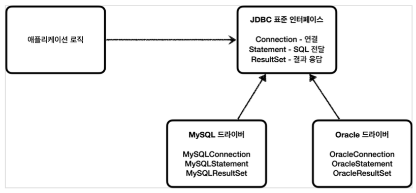    
>> 애플리케이션 서버와 DB의 일반적인 사용법은 아래와 같습니다.
>> JDBC(Java Database Connectivity)는 자바에서 데이터베이스에 접속할 수 있도록 하는 자바 API입니다.   
>> JDBC는 기존의 데이터베이스를 다른 종류의 데이터베이스로 변경하면 애플리케이션 서버에 개발된 데이터베이스 사용 코드도 함께 변경해야하는 문제와,    
>> 개발자가 각각의 데이터베이스마다 커넥션 연결, SQL 전달, 그리고 그 결과를 응답 받는 방법을 새로 학습해야 하는 문제를 해결하기 위해 등장했습니다.    
>>    
>> JDBC가 제공하는 <code>DriverManager</code>는 라이브러리에 등록된 DB 드라이버들을 관리하고, 커넥션을 획득하는 기능을 제공합니다.       
>> #### <code>DriverManager</code> 커넥션 요청 흐름
>> 1. 애플리케이션 로직에서 커넥션이 필요하면 <code>DriverManager.getConnection()</code>을 호출합니다.    
>> 2. <code>DriverManager</code> 는 라이브러리에 등록된 드라이버 목록을 자동으로 인식하고, 이 드라이버들에게 순서대로 정보를 넘겨서 커넥션을 획득할 수 있는지 확인합니다.   
>> 3. 이렇게 찾은 커넥션 구현체가 클라이언트에 반환됩니다.     
>>    
>> #### 리소스 정리
>> 쿼리를 실행하고 나면 리소스를 정리해야 합니다.    
>> 예제에서는 <code>Connection</code>, <code>PreparedStatement</code>를 사용했습니다.   
>> 리소스를 정리할 때는 항상 역순으로 해야합니다.    
>> <code>Connection</code>을 먼저 획득하고, <code>Connection</code>를 통해 통해 <code>PreparedStatement</code>를 만들었기 때문에, 리소스를 반환할 때는 <code>PreparedStatement</code>를 먼저 종료하고, 그 다음에 <code>Connection</code>을 종료하면 됩니다.    
>>    
>> 리소스 정리는 꼭 해줘야 합니다. 따라서, 예외가 발생하든, 하지 않든 항상 수행되어야 하므로 finally 구문에 주의해서 작성해야합니다.    
>> 만약 이 부분을 놓치게 되면 커넥션이 끊어지지 않고 계속 유지되는 문제가 발생할 수 있습니다.    
>> 이런 것을 리소스 누수라고 하는데, 결과적으로 커넥션 부족으로 장애가 발생할 수 있습니다.    
>>    
>> ※ <code>PreparedStatement</code>는 <code>Statement</code>의 자식 타입인데, <code>?</code>를 통한 파라미터 바인딩을 가능하게 해줍니다. <code>SQL Injection</code> 공격을 예방하려면 <code>PreparedStatement</code> 를 통한 파라미터 바인딩 방식을 사용해야 합니다.
>
>> #### 커넥션풀과 데이터소스 이해
>> 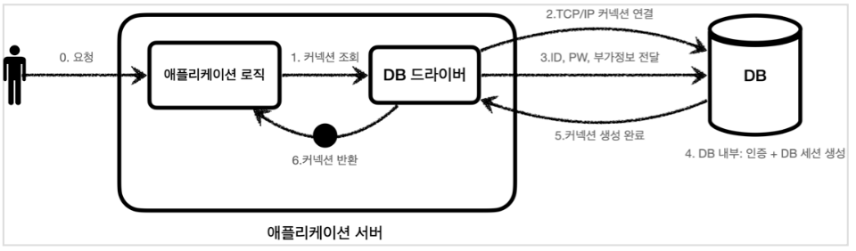
>> #### 데이터 베이스 커넥션 획득 과정
>>
>> 데이터 베이스 커넥션을 획득할 때는 다음과 같은 복잡한 과정을 거칩니다.     
>> 1. 애플리케이션 로직은 DB 드라이버를 통해 커넥션을 조회합니다.  
>> 2. DB 드라이버는 DB와 <code>TCP/IP</code> 커넥션을 연결합니다. 이 과정에서 3 way handshake 같은 <code>TCP/IP</code> 연결을 위한 네트워크 동작이 발생합니다.   
>> 3. DB 드라이버는 <code>TCP/IP</code> 커넥션이 연결되면 ID, PW와 기타 부가정보를 DB에 전달합니다.
>> 4. DB는 ID, PW를 통해 내부 인증을 완료하고, 내부에 DB 세션을 생성합니다.
>> 5. DB는 커넥션 생성이 완료되었다는 응답을 보냅니다.    
>> 6. DB 드라이버는 커넥션 객체를 생성해서 클라이언트에 반환합니다.        
>> 
>> 이렇게 커넥션을 새로 만드는 것은 과정도 복잡하고, 시간도 많이 소모되는 일입니다.    
>> DB는 물론이고 애플리케이션 서버에서도 <code>TCP/IP</code> 커넥션을 새로 생성하기 위한 리소스를 매번 사용해야 합니다.   
>> 진짜 문제는, 고객이 애플리케이션을 사용할 때, SQL을 실행하는 시간 뿐만 아니라 커넥션을 새로 만드는 시간이 추가되기 떄문에 결과적으로 응답 속도에 영향을 줍니다. 이것은 사용자에게 좋지 않은 경험을 줄 수 있습니다.    
>>       
>> 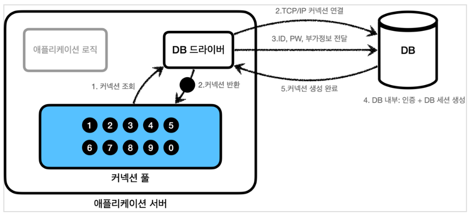
>> 이런 문제를 한번에 해결하는 아이디어가 바로 커넥션을 미리 생성해두고 사용하는 커넥션풀 이라는 방법입니다.   
>> 애플리케이션을 시작하는 시점에 커넥션 풀은 필요한 만큼 커넥션을 미리 확보해서 풀에 보관합니다. 보통 얼마나 보관할 지는 서비스의 특징과 서버 스펙에 따라 다르지만 기본값은 보통 10개입니다.    
>>    
>> - 애플리케이션 로직에서는 이제는 DB 드라이버를 통해서 새로운 커넥션을 획득하는 것이 아닙니다.    
>> - 이제는 커넥션 풀을 통해 이미 생성되어 있는 커넥션을 객체 참조로 그냥 가져다가 쓰기만 하면 됩니다.   
>> - 커넥션 풀에 커넥션을 요청하면, 커넥션 풀은 자신이 가지고 있는 커넥션 중에 하나를 반환합니다.
>>        
>> - 애플리케이션 로직은 커넥션 풀에서 받은 커넥션을 사용해서 SQL을 데이터베이스에 전달하고 그 결과를 받아서 처리합니다.   
>> - 커넥션을 모두 사용하고 나면 이제는 커넥션을 종료하는 것이 아니라, 다음에 다시 사용할 수 있도록 해당 커넥션을 그대로 커넥션 풀에 반환하면 됩니다. 여기서 주의할 점은 커넥션을 종료하는 것이 아니라 커넥션이 살아있는 상태로 커넥션 풀에 반환해야 한다는 것입니다.           
>>          
>> 적절한 커넥션 풀의 숫자는 서비스의 특징과 애플리케이션 서버 스펙, DB 서버 스펙에 따라 다르기 떄문에 성능 테스트를 통해서 정해야 합니다.    
>> 커넥션 풀은 서버당 최대 커넥션 수를 제한할 수 있습니다. 따라서 DB에 무한정 연결이 생성되는 것을 막아주어서 DB를 보호하는 효과도 있습니다.    
>> 실무에서는 커넥션풀은 항상 기본으로 하며, 대표적인 커넥션풀 오픈소스는 <code>commons-dbcp2</code>, <code>tomcat-jdbc pool</code>, <code>HikariCP</code>등이 있습니다.   
>> 스프링 부트 2.0 부터는 기본 커넥션 풀로 <code>HikariCP</code>를 제공합니다.
>>             
>> 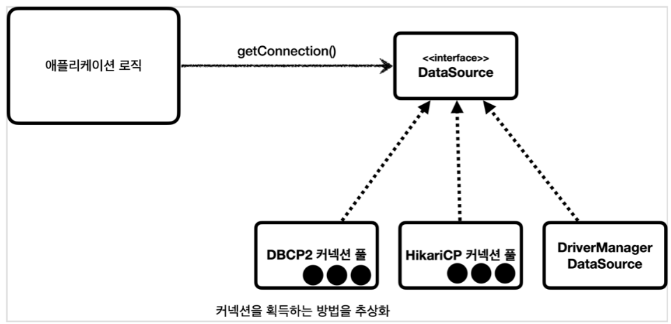    
>> 커넥션을 얻는 방법은 앞서 공부한 JDBC <code>DriverManger</code> 를 직접 사용하거나, 커넥션 풀을 사용하는 등 다양한 방법이 존재합니다.    
>>         
>> 만약에 앞서 JDBC로 개발한 애플리케이션 처럼 <code>DriverManager</code>를 통해서 커넥션을 획득하다가, 커넥션 풀을 사용하는 방법으로 변경하려면 어떻게 해야할까요?    
>>     
>> 예를 들어서 애플리케이션 로직에서 <code>DriverManager</code>를 사용해서 커넥션을 획득하다가 <code>HikariCP</code>같은 커넥션 풀을 사용하도록 변경하면, 커넥션을 획득하는 애플리케이션 코드도 함께 변경해야 합니다. 의존관계가 <code>DriverManager</code>에서 <code>HikariCP</code>로 변경되기 때문입니다.     
>>     
>> 그래서 자바에서는 이런 문제를 해결하기 위해 <code>javax.sql.DataSource</code> 라는 인터페이스를 제공합니다.   
>> <code>DataSource</code>는 커넥션을 획득하는 방법을 추상화하는 인터페이스 입니다.    
>> 이 인터페이스의 핵심 기능은 커넥션 조회 하나입니다.(다른 일부 기능도 있지만..)      
>>      
>> 정리를 해보면,    
>> - 대부분의 커넥션 풀은 <code>DataSource</code>에 인터페이스를 이미 구현해두었습니다. 따라서 개발자는 <code>DBCP2 커넥션 풀</code>, <code>HikariCP 커넥션 풀</code>의 코드를 직접 의존하는 것이 아니라, <code>DataSource</code> 인터페이스만 의존하도록 애플리케이션 로직을 작성하면 됩니다.    
>> - 커넥션 풀 구현 기술을 변경하고 싶으면 해당 구현체로 갈아끼우기만 하면 됩니다.
>> - <code>DriverManager</code>는 <code>DataSource</code> 인터페이스를 사용하지 않습니다. 따라서 <code>DriverManager</code>를 사용하다가 <code>DataSource</code>기반의 커넥션 풀을 사용하도록 변경하면 관련 코드를 다 고쳐야 합니다.        
>> 이런 문제를 해결하기 위해 스프링은 <code>DriverManager</code>도 <code>DataSource</code>를 통해서 사용할 수 있도록 <code>DriverManagerDataSource</code>라는 <code>DataSource</code>를 구현한 클래스를 제공합니다. 
>> - 자바는 <code>DataSource</code>를 통해 커넥션을 획득하는 방법을 추상화했습니다. 이제 애플리케이션 로직은 <code>DataSource</code> 인터페이스에만 의존하면 됩니다. 덕분에 <code>DriverManagerDataSource</code>를 통해서 <code>DriverManager</code>를 사용하다가 커넥션 풀을 사용하도록 코드를 변경해도 애플리케이션 로직은 변경하지 않아도 됩니다. 
>
>
>>  #### 트랜잭션 이해
>>
>> 트랜잭션은 ACID라 하는 원자성(Atomicity), 일관성(Consistency), 격리성(Isolation), 지속성(Durability)을 보장해야 합니다.
>> - **원자성** : 트랜잭션 내에서 실행한 작업들은 마치 하나의 작업인 것처럼 모두 성공 하거나 모두 실패해야 한다.
>> - **일관성** : 모든 트랜잭션은 일관성 있는 데이터베이스 상태를 유지해야 한다. 예를 들어 데이터베이스에서 정한 무결성 제약 조건을 항상 만족해야 한다.
>> - **격리성** : 동시에 실행되는 트랜잭션들이 서로에게 영향을 미치지 않도록 격리한다. 예를 들어 동시에 같은 데이터를 수정하지 못하도록 해야 한다. 격리성은 동시성과 관련된 성능 이슈로 인해 트랜잭션 격리수준(Isolation Level)을 선택할 수 있다.
>> - **지속성** : 트랜잭션을 성공적으로 끝내면 그 결과가 항상 기록되어야 한다. 중간에 시스템에 문제가 발생해도 데이터베이스 로그 등을 사용해서 성공한 트랜잭션 내용을 복구해야 한다.     
>>    
>> **트랜잭션 격리 수준 - Isolation Level**
>> - READ UNCOMMITED(커밋되지 않은 읽기) ※ 성능 높음
>> - READ COMMITTED(커밋된 읽기)
>> - REPEATABLE READ(반복 가능한 읽기)
>> - SERIALIZABLE(직렬화 가능) ※ 성능 낮음     
>>    
>> 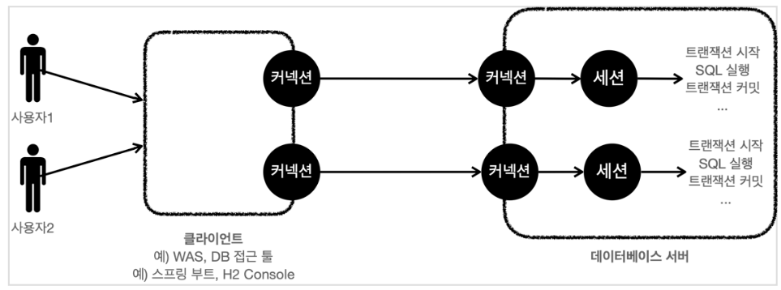       
>> 트랜잭션을 더 자세히 이해하기 위해 데이터베이스 서버 연결 구조와 DB 세션에 대해 알아보았습니다.   
>> - 사용자는 웹 애플리케이션 서버(WAS)나 DB 접근 툴 같은 클라이언트를 사용해서 데이터베이스 서버에 접근할 수 있습니다. 클라이언트는 데이터베이스 서버에 연결을 요청하고 커넥션을 맺게 됩니다. 이때 데이터베이스 서버는 내부에 세션이라는 것을 만듭니다. 앞으로 해당 커넥션을 통한 모든 요청은 이 세션을 통해서 실행하게 됩니다.    
>> - 쉽게 이야기해서 개발자가 클라이언트를 통해 SQL을 전달하면 현재 커넥션에 연결된 세션이 SQL을 실행합니다.      
>> - 세션은 트랜잭션을 시작하고, 커밋 또는 롤백을 통해 트랜잭션을 종료합니다. 그리고 이후에 새로운 트랜잭션을 다시 시작할 수 있습니다.    
>> - 사용자가 커넥션을 닫거나 또는 DBA(DB관리자)가 세션을 강제로 종료하면 세선은 종료됩니다.    
>> - 커넥션 풀을 사용할 경우, 커넥션 풀이 10개의 커넥션을 생성하면, 세션도 10개 만들어집니다.     
>>      
>> <code>set autocommit false; // 수동커밋 모드 설정</code>을 "트랜잭션을 시작 한다" 라고 표현합니다.    
>> 수동 커밋 설정을 하면 이후에 꼭 <code>commit</code>, <code>rollback</code> 을 호출해야 합니다.        
>>    
>> 만약, 세션 1이 트랜잭션을 시작하고, 데이터를 수정하는 동안, 아직 커밋을 수행하지 않았는데, 세션 2에서 동시에 같은 데이터를 수정하게 되면 여러가지 문제가 발생합니다. 바로 트랜잭션의 원자성이 깨지는 것입니다. 여기에 더해서 세션1이 중간에 롤백을 하게 되면 세션2는 잘못된 데이터를 수정하는 문제가 발생합니다.   
>>    
>> 이런 문제를 방지하려면, 세션이 트랜잭션을 시작하고 데이터를 수정하는 동안 커밋이나 롤백 전까지 다른 세션에서 해당 데이터를 수정할 수 없게 막아야합니다.    
>>     
>> 데이터베이스는 이런 문제를 해결하기 위해 락(Lock)이라는 개념을 제공합니다.  
>> 특정 데이터에 먼저 접근한 세션이 락을 가지게 되며,  
>> 특정 세션이 데이터에 접근했는데 락을 획득할 수 없으면 대기하게 되고, 이 대기시간을 설정할 수 있으며, <code>SET LOCK_TIMEOUT 10000</code>을 하면 10초 로 설정됩니다. 이 시간동안 락을 얻지 못하면 타임아웃 오류가 발생합니다.    
>>    
>> 보통은 데이터를 조회할 때는 락을 획득하지 않고 바로 데이터를 조회할 수 있습니다.    
>> 특정 데이터 수정이 아니라, 조회를 할 때도, 락을 획득하고 싶을 때는 <code>select for update</code> 구문을 사용하면 됩니다.     
>>       
>> 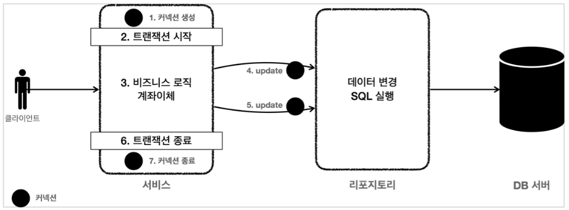
>> - 트랜잭션은 비즈니스 로직이 있는 서비스 계층에서 시작해야 합니다. 비즈니스 로직이 잘못되면 해당 비즈니스 로직으로 인해 문제가 되는 부분을 함께 롤백해야 하기 때문입니다.   
>> - 그런데 트랜잭션을 시작하려면 커넥션이 필요합니다. 결국 서비스 계층에서 커넥션을 만들고, 트랜잭션 커밋 이후에 커넥션을 종료해야 합니다.    
>> - 애플리케이션에서 DB 트랜잭션을 사용하려면 트랜잭션을 사용하는 동안 같은 커넥션을 유지해야 합니다. 그래야 같은 세션을 사용할 수 있습니다.
>> 
>> 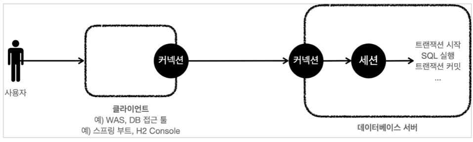
>> 애플리케이션에서 같은 커넥션을 유지 하기위한 단순한 방법은 커넥션을 파라미터로 전달해서 같은 커넥션이 사용되도록 유지하는 것입니다.
>> 

>
>> #### 스프링과 문제 해결 - 트랜잭션
>> 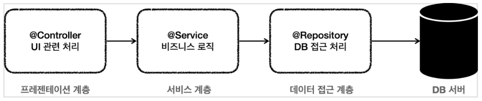      
>> 여러가지 애플리케이션 구조가 있지만, 가장 단순하며 많이 사용하는 방법은 역할에 따라 3가지 계층으로 나누는 것 입니다.    
>> - 프레젠테이션 계층
>>   - UI와 관련된 처리 담당
>>   - 웹 요청과 응답
>>   - 사용자 요청을 검증
>>   - 주 사용 기술: 서블릿과 HTTP 같은 웹 기술, 스프링 MVC
>> - 서비스 계층
>>   - 비즈니스 로직을 담당
>>   - 주 사용 기술 : 가급적 특정 기술에 의존하지 않고, 순수 자바 코드로 작성
>> - 데이터 접근 계층
>>   - 실제 데이터베이스에 접근하는 코드
>> - 주 사용 기술 : JDBC, JPA, File, Redis, Mongo...    
>>    
>>
>> - 여기서 가장 중요한 곳은 핵심 비즈니스 로직이 들어있는 서비스 계층입니다.    
>> - 시간이 흘러서 UI(웹)과 관련된 부분이 변하고, 데이터 저장 기술을 다른 기술로 변경해도, 비즈니스 로직은 최대한 변경없이 유지되어야합니다.      
>> - 이렇게 하려면 서비스 계층을 특정 기술에 종속적이지  않게 개발해야 합니다.      
>>  - 이렇게 계층을 나눈 이유도, 서비스 계층을 최대한 순수하게 유지하기 위한 목적이 큽니다. 기술에 종속적인 부분은 프레젠테이션 계층, 데이터 접근 계층에서 가지고 갑니다.
>>  - 프레젠테이션 계층은 클라이언트가 접근하는 UI와 관련된 기술인 웹, 서블릿, HTTP 와 관련된 부분을 담당해줍니다. 그래서 서비스 계층을 UI와 관련된 기술로부터 보호해줍니다. 예를 들어서 HTTP API를 사용하다가 GRPC 같은 기술로 변경해도 프레젠테이션 계층의 코드만 변경하고, 서비스 계층은 변경하지 않아도 됩니다.
>>  - 데이터 접근 계층은 데이터를 저장하고 관리하는 기술을 담당해줍니다. 그래서 JDBC, JPA 와 같은 구체적인 데이터 접근 기술로부터 서비스 계층을 보호해줍니다. 예를 들어서 JDBC를 사용하다가 JPA로 변경해도 서비스 계층은 변경하지 않아도 됩니다. 물론 서비스 계층에서 데이터 접근 계층을 직접 접근하는 것이 아니라, 인터페이스를 제공하고, 서비스 계층은 이 인터페이스에 의존하는 것이 좋습니다. 그래야 서비스 코드의 변경 없이 <code>JdbcRepository</code>를 <code>JpaRepository</code>로 변경할 수 있습니다.      
>>- 서비스 계층이 특정 기술에 종속되지 않기 때문에 비즈니스 로직을 유지보수 하기도 쉽고, 테스트 하기도 쉽습니다.    
>>- 정리하자면, 서비스 계층은 가급적 비즈니스 로직만 구현하고 특정 구현 기술에 직접 의존해서는 안됩니다. 이렇게 하면 향후 구현 기술이 변경될 때 변경의 영향 범위를 최소화 할 수 있습니다.   
>>          
>>        
>> 현재 단계까지 JDBC로 개발한 애플리케이션의 문제점은 크게 3가지 였습니다.   
>> - 트랜잭션 문제
>> - 예외 누수 문제
>> - JDBC 반복 문제    
>>
>>     
>> 우선, 가장 큰 문제는 트랜잭션을 적용하면서 생긴 다음과 같은 문제들입니다. 
>> #### 트랜잭션 문제
>> - JDBC 구현 기술이 서비스 계층에 누수되는 문제
>>  - 트랜잭션을 적용하기 위해 JDBC 구현 기술이 서비스 계층에 누수되었습니다.
>>  - 서비스 계층은 순수해야 합니다.→ 구현 기술을 변경해도 서비스 계층 코드는 최대한 유지할 수 있어야 합니다.
>>    - 그래서 데이터 접근 계층에 JDBC 코드를 다 몰아두는 것입니다.
>>    - 물론 데이터 접근 계층이 구현 기술이 변경될 수도 있으니 데이터 접근 계층은 인터페이스를 제공하는 것이 좋습니다.
>>  - 서비스 계층은 특정 기술에 종속되지 않아야 합니다. 그래서 노력하여 데이터 접근 계층으로 JDBC 관련 코드를 모았는데, 트랜잭션을 적용하면서 결국 서비스 계층에 JDBC 구현 기술의 누수가 발생했습니다.    
>> - 트랜잭션 동기화 문제
>>   - 같은 트랜잭션을 유지하기 위해 커넥션을 파라미터로 넘겨야합니다. 
>>   - 이때 파생되는 문제들도 있습니다. 똑같은 기능도 트랜잭션용 기능과 트랜잭션을 유지하지 않아도 되는 기능으로 분리해야합니다.
>> - 트랜잭션 적용 반복 문제
>>   - 트랜잭션 적용 코드를 보면 반복이 많습니다. <code>try</code>, <code>catch</code>, <code>finally</code> ...
>>    
>> #### 예외 누수 문제   
>> - 데이터 접근 계층의 JDBC 구현 기술 예외가 서비스 계층으로 전파됩니다.
>> - <code>SQLException</code>은 체크 예외이기 때문에 데이터 접근 계층을 호출한 서비스 계층에서 해당 예외를 잡아서 처리하거나 명시적으로 <code>throws</code>를 통해서 다시 밖으로 던져야합니다.
>> - <code>SQLException</code>은 JDBC 전요익술입니다. 향후 JPA나 다른 데이터 접근 기술을 사용하면, 그에 맞는 다른 예외로 변경해야 하고, 결국 서비스 코드도 수정해야 합니다.     
>>        
>> #### JDBC 반복 문제
>> -  지금까지 작성한 <code><MemberRepository</code>는 순수한 JDBC를 사용했습니다.
>> - 이 코드들은 유사한 반복이 너무 많습니다.
>>  - <code>try</code>, <code>catch</code>, <code>finally</code>...
>>  - 커넥션을 열고, <code>PreparedStatement</code>를 사용하고, 결과를 매핑하고...실행하고, 커넥션과 리소스를 정리합니다.       
>>       
>> #### 스프링과 문제 해결     
>> 스프링은 서비스 계층을 순수하게 유지하면서, 지금까지 이야기한 문제들을 해결할 수 있는 다양한 방법과 기술들을 제공합니다.   
>> 스프링을 사용해서 현재 애플리케이션이 가진 문제를 하나씩 해결해보겠습니다.      
>>
>> #### 트랜잭션 추상화      
>> 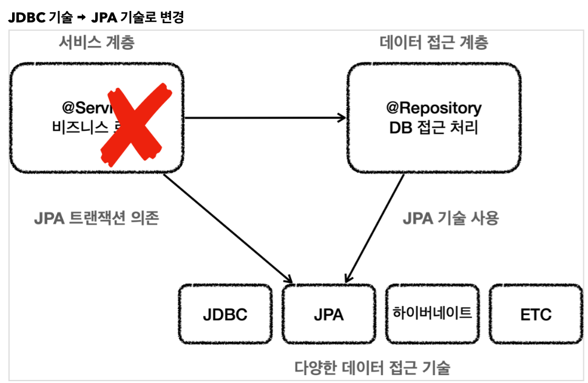
>> 현재 서비스 계층은 트랜잭션을 사용하기 위해서 JDBC 기술에 의존하고 있습니다.    
>> 향수 JDBC에서 JPA같은 다른 데이터 접근 기술로 변경하면, 서비스 계층의 트랜잭션 관련 코드도 모두 함꼐 수정해야 합니다.       
>>       
>> 이 문제를 해결하려면, 단순하게 생각하면 트랜잭션 기능을 추상화히면 됩니다.        
>> 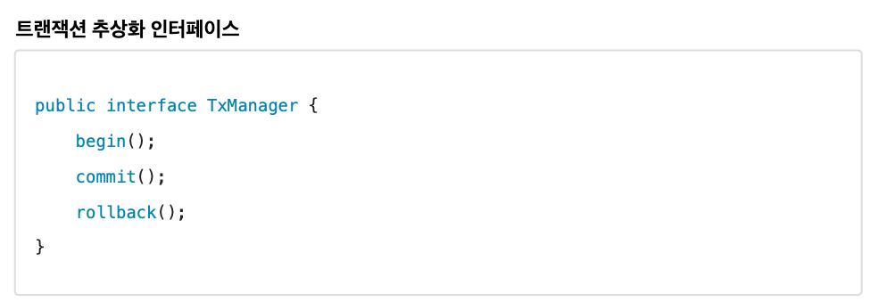      
>> 트랜잭션은 사실 단순합니다. 트랜잭션을 시작하고, 비즈니스 로직의 수행이 끝나면 커밋하거나 롤백하면 됩니다.       
>> 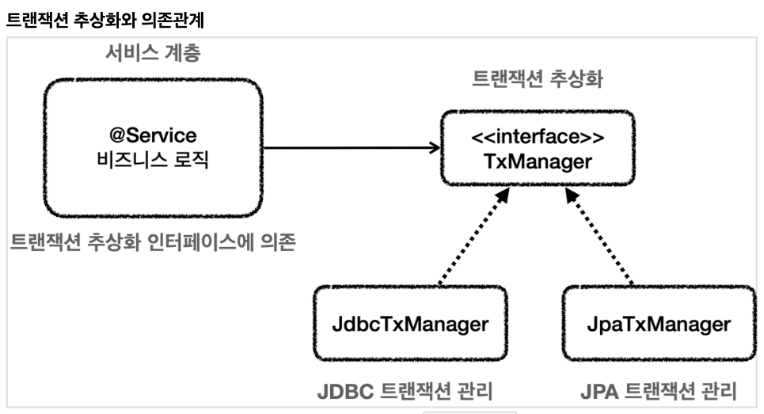       
>> 그러면, 위의 인터페이스를 기반으로 각각의 기술에 맞는 구현체를 만들면 될 것입니다.     
>> 클라이언트인 서비스는 인터페이스에 의존하고, DI를 사용한 덕분에 OCP 원칙을 지킬 수 있습니다.   
>> 이제 트랜잭션을 사용하는 서비스 코드를 전혀 변경하지 않고, 트랜잭션 기술을 마음껏 변경할 수 있게 되었습니다.   
>>      
>> #### 스프링의 트랜잭션 추상화    
>> 스프링은 이미 이런 고민을 다 해두었습니다. 우리는 스프링이 제공하는 트랜잭션 추상화 기술을 사용하면 됩니다.    
>> 심지어 데이터 접근 기술에 따른 트랜잭션 구현체도 대부분 만들어두어서 가져다 사용하기만 하면 됩니다.       
>> 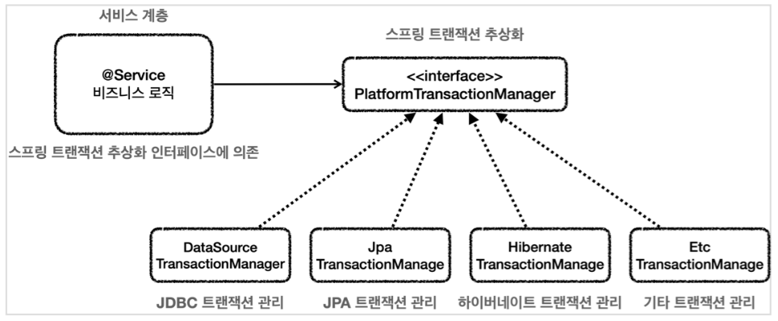      
>> 트랜잭션 추상화의 핵심은 <code>PlatformTransactionManager</code> 인터페이스입니다.   
>> - <code>org.springframework.transaction.PlatformTransactionManager</code>        
>>      
>> ※ 참고로 스프링 5.3부터는 JDBC 트랜잭션을 관리할 때 <code>DataSourceTransactionManager</code> 를 상속받아서 약간의  기능을 확장한 <code>JdbcTransactionManager</code> 를 제공한다. 둘의 기능 차이는 크지 않으므로 같은 것으로 이해하면 됩니다.
>>      
>> #### 트랜잭션 동기화    
>> 스프링이 제공하는 트랜잭션 매니저는 크게 2가지 역할을 합니다.    
>> - 트랜잭션 추상화
>> - 리소스 동기화 
>>       
>> 트랜잭션 추상화는 앞에서 알아보았습니다.
>> 
>> 이번에는 리소스 동기화에 대해 알아보겠습니다.
>> 트랜잭션을 유지하려면 트랜잭션의 시작부터 끝까지 같은 데이터베이스 커넥션을 유지해야합니다. 결국 같은 커넥션을 동기화(맞추어 사용)하기 위해서는 이전에는 파라미터로 커넥션을 전달하는 방법을 사용했습니다.   
>> 파라미터로 커넥션을 전달하는 방법은 코드가 지저분해지는 것은 물론이고, 커넥션을 넘기는 메서드와 넘기지 않는 메서드를 중복해서 만들어야 하는 등 여러가지 단점들이 많습니다.      
>>      
>> 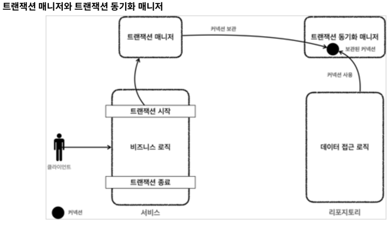     
>> - 스프링은 트랜잭션 동기화 매니저를 제공합니다. 이것은 쓰레드 로컬(ThreadLoacl)을 사용해서 커넥션을 동기화해줍니다. 트랜잭션 매니저는 내부에서 이 트랜잭션 동기화 매니저를 사용합니다.
>> - 트랜잭션 동기화 매니저는 쓰레드 로컬을 사용하기 때문에 멀티 쓰레드 상황에 안전하게 커넥션을 동기화 할 수 있습니다. 따라서 커넥션이 필요하면 트랜잭션 동기화매니저를 통해 커넥션을 획득하면 됩니다. 따라서 이전처럼 파라미터로 커넥션을 전달하지 않아도 됩니다.   
>>      
>> 동작방식   
>> 1. 트랜잭션을 시작하려면 커넥션이 필요합니다. 트랜잭션 매니저는 데이터소스를 통해 커넥션을 만들고 트랜잭션을 시작합니다.
>> 2. 트랜잭션 매니저는 트랜잭션이 시작된 커넥션을 트랜잭션 동기화 매니저에 보관합니다.
>> 3. 리포지토리는 트랜잭션 동기화 매니저에 보관된 커넥션을 꺼내서 사용합니다. 따라서 파라미터로 커넥션을 전달하지 않아도 됩니다.   
>> 4. 트랜잭션이 종료되면 트랜잭션 매니저는 트랜잭션 동기화 매니저에 보관된 커넥션을 통해 트랜잭션을 종료하고, 커넥션도 닫습니다.    
>>    
>> 트랜잭션 동기화 매니저    
>> 다음 트랜잭션 동기화 매니저 클래스를 열어보면, 쓰레드 로컬을 사용하는 것을 확인할 수 있습니다.    
>> <code>org.springframework.transaction.support.TransactionSynchronizationManager</code>   
>>    
>> ※ 참고 : 쓰레드 로컬을 사용하면 각각이 쓰레드마다 별도의 저장소가 부여됩니다. 따라서 해당 쓰레드만 해당 데이터에 접근할 수 있습니다.
>>     
>> #### 트랜잭션 매니저의 전체 동작 흐름
>> 트랜잭션 시작
>> 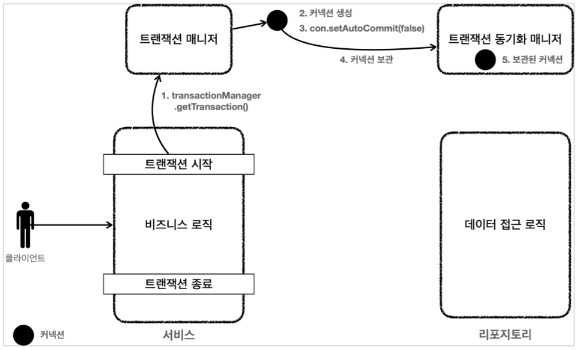        
>> 클라이언트의 요청으로 서비스 로직을 실행합니다.      
>> 1. 서비스 계층에서 <code>transactionManager.getTransaction()</code>을 호출해서 트랜잭션을 시작합니다.
>> 2. 트랜잭션을 시작하려면 먼저 데이터베이스 커넥션이 필요합니다. 트랜잭션 매니저는 내부에서 데이터소스를 사용해서 커넥션을 생성합니다.
>> 3. 커넥션을 수동 커밋 모드로 변경해서 실제 데이터베이스 트랜잭션을 시작합니다.
>> 4. 커넥션을 트랜잭션 동기화 매니저에 보관합니다.
>> 5. 트랜잭션 동기화 매니저는 쓰레드 로컬에 커넥션을 보관합니다. 따라서 멀티 쓰레드 환경에 안전하게 커넥션을 보관할 수 있습니다.      
>>       
>> 로직 실행
>> 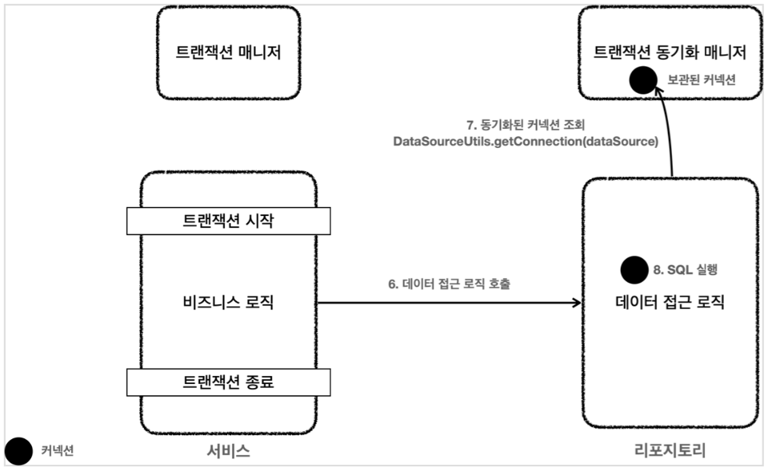       
>> 6. 서비스는 비즈니스 로직을 실행하면서 리포지토리의 메서드들을 호출합니다. 이때 커넥션을 파라미터로 전달하지 않습니다.
>> 7. 리포지토리 메서드들은 트랜잭션이 시작된 커넥션이 필요합니다. 리포지토리는 <code>DataSourceUtils.getConnection()</code>을 사용해서 트랜잭션 동기화 매니저에 보관된 커넥션을 꺼내서 사용합니다. 이 과정을 통해서 자연스럽게 같은 커넥을 사용하고, 트랜잭션도 유지됩니다.    
>> 8. 획득한 커넥션을 사용해서 SQL을 데이터베이스에 전달해서 실행합니다.
>>      
>> 트랜잭션 종료
>> 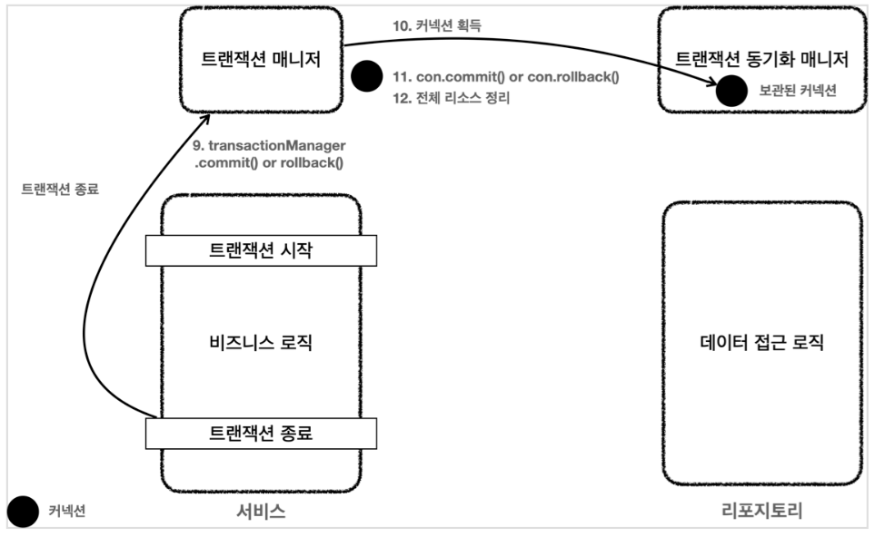 
>> 9. 비즈니스 로직이 끝나고 트랜잭션을 종료합니다. 트랜잭션은 커밋하거나 롤백하면 종료됩니다.
>> 10. 트랜잭션을 종료하려면 동기화된 커넥션이 필요합니다. 트랜잭션 동기화 매니저를 통해 동기화된 커넥션을 획득합니다.
>> 11. 획득한 커넥션을 통해 데이터베이스에 트랜잭션을 커밋하거나 롤백합니다.
>> 12. 전체 리소스를 정리합니다.
>>     1. 트랜잭션 동기화 매니저를 정리합니다. 쓰레드 로컬은 사용후 꼭 정리해야합니다.
>>     2. <code>con.setAutoCommit(ture)</code> 로 되돌립니다. 커넥션 풀을 고려해야합니다.
>>     3. con.close() 를 호출해서 커넥션을 종료합니다. 커넥션 풀을 사용하는 경우 <code>con.close()</code>를 호출하면 커넥션 풀에 반환됩니다.
>>       
>> 정리
>> - 트랜잭션 추상화 덕분에 서비스 코드는 이제 JDBC 기술에 의존하지 않습니다.
>>   - 이후 JDBC에서 JPA로 변경해도 서비스 코드를 그대로 유지할 수 있습니다.
>>   - 기술 변경시 의존관계 주입만 <code>DataSourceTransactionManager</code>에서 <code>JpaTransactionManager</code> 로 변경해주면 됩니다.
>>   - <code>java.sql.SQLException</code>이 아직 남아있지만 이 부분은 뒤에 예외 문제에서 해결하겠습니다.
>> - 트랜잭션 동기화 매니저 덕분에 커넥션을 파라미터로 넘기지 않아도 됩니다.
>>    
>> ※ 참고 : 여기서 알아본 동작 방식은 <code>DataSourceTransactionManager</code>의 동작 방식을 위주로 알아본 것이고, 다른 트랜잭션 매니저는 해당 기술에 맞도록 변형되어 동작합니다.
>>      
>> 트랜잭션을 사용하는 로직을 살펴보면 다음과 같은 패턴이 반복되는 것을 확인할 수 있습니다.
>> 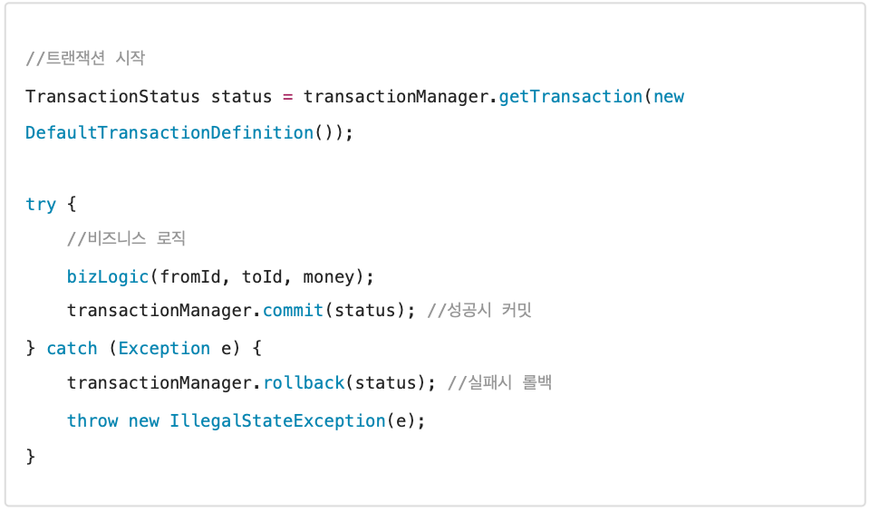     
>> - 트랜잭션을 시작하고, 비즈니스 로직을 실행하고, 성공하면 커밋하고, 예외가 발생해서 실패하면 롤백합니다.
>> - 다른 서비스에서 트랜잭션을 시작하려면 <code>try</code>, <code>catch</code>, <code>finally</code>를 포함한 성공시 커밋, 실패시 롤백 코드가 반복될 것입니다.
>> - 이런 형태는 각각의 서비스에서 반복됩니다. 달라지는 부분은 비즈니스 로직 뿐입니다.
>> - 이럴 때 <code>템플릿 콜백 패턴</code>을 활용하면 이런 반복 문제를 깔끔하게 해결할 수 있습니다.    
>> 
>> #### 트랜잭션 템플릿     
>> 템플릿 콜백 패턴을 적용하려면 템플릿을 제공하는 클래스를 작성해야 하는데, 스프링은 <code>TransactionTemplate</code>라는 템플릿 클래스를 제공합니다.    
>>      
>> TransactionTemplate
>> 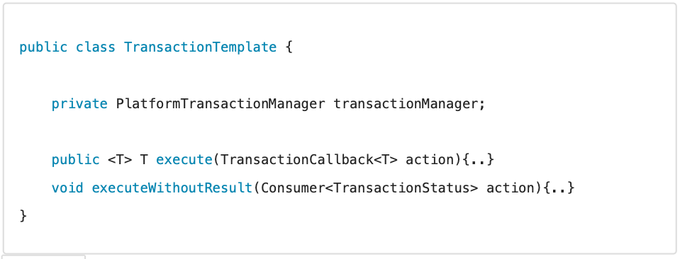      
>> - <code>execute()</code> : 응답 값이 있을 때 사용합니다.
>> - <code>executeWithoutResult()</code> : 응답 값이 없을 때 사용합니다.       
>>      
>> 트랜잭션 템플릿 사용 로직
>>       
>> - 트랜잭션 템플릿 덕분에 트랜잭션을 시작하고, 커밋하거나 롤백하는 코드가 모두 제거되었습니다.     
>> - 트랜잭션 템플릿의 기본 동작은 다음과 같습니다.
>>   - 비즈니스 로직이 정상 수행되면 커밋합니다.      
>>   - 언체크 예외가 발생하면 롤백합니다. 그 외의 경우 커밋합니다. (체크 예외의 경우에는 커밋하는데, 이 부분은 뒤에서 알아보겠습니다.)
>> - 코드에서 예외를 처리하기 위해 <code>try~catch</code>가 들어갔는데, <code>bizLogic()</code> 메서드를 호출하면 <code>SQLException</code> 체크 예외를 넘겨줍니다. 해당 람다에서 체크 예외를 밖으로 던질 수 없기 때문에 언체크 예외로 바꾸어 던지도록 예외를 전환했습니다.
>>       
>> 정리
>> - 트랜잭션 템플릿 덕분에, 트랜잭션을 사용할 때 반복하는 코드를 제거할 수 있었습니다.
>> - 하지만 여전히 서비스 로직에는, 비즈니스 로직 뿐만 아니라 트랜잭션을 처리하는 기술 로직이 함께 포함되어 있습니다.     
>> - 애플리케이션을 구성하는 로직을 핵심 기능과 부가 기능으로 구분하자면 서비스 입장에서 비즈니스 로직은 핵심 기능이고, 트랜잭션은 부가 기능입니다.
>> - 이렇게 비즈니스 로직과 트랜잭션을 처리하는 기술 로직이 한 곳에 있으면 두 관심사를 하나의 클래스에서 처리하게 됩니다. 결과적으로 코드를 유지보수하기 어려워집니다.
>> - 서비스 로직은 가급적 핵심 비즈니스 로직만 있어야 합니다. 하지만 트랜잭션 기술을 사용하려면 어쩔 수 없이 트랜잭션 코드가 나와야 합니다.   
>>       
>> #### 트랜잭션 AOP 이해    
>> - 지금까지는 트랜잭션을 편리하게 처리하기 위해서 트랜잭션 추상화도 도입하고, 추가로 반복적인 트랜잭션 로직을 해결하기 위해 트랜잭션 템플릿도 도입했습니다.
>> - 트랜잭션 템플릿 덕분에 트랜잭션을 처리하는 반복 코드는 해결할 수 있었습니다. 하지만 서비스 계층에 순수한 비즈니스 로직만 남긴다는 목표는 아직 달성하지 못했습니다.   
>> - 이럴 때 스프링 AOP를 통해 프록시를 도입하면 문제를 깔끔하게 해결할 수 있습니다.
>> 
>> 프록시를 통한 문제 해결       
>> 프록시 도입 전
>> 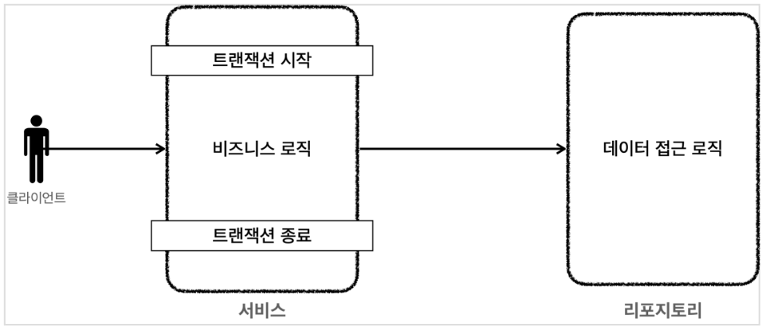      
>> 프록시를 도입하기 전에는 기존처럼 서비스의 로직에서 트랜잭션을 직접 시작합니다.       
> 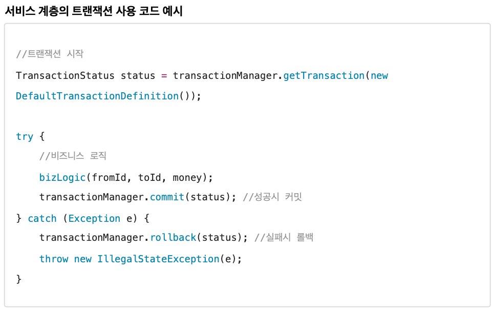      
>>       
>> 프록시 도입 후         
>> 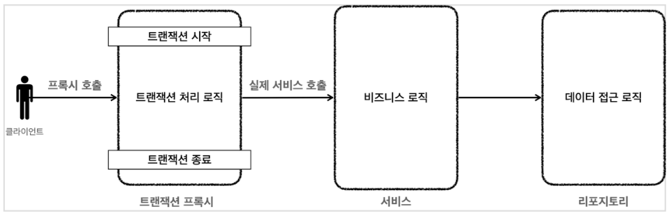       
>> 프록시를 사용하면 트랜잭션을 처리하는 객체와 비즈니스 로직을 처리하는 서비스 객체를 명확하게 분리할 수 있습니다.       
>> 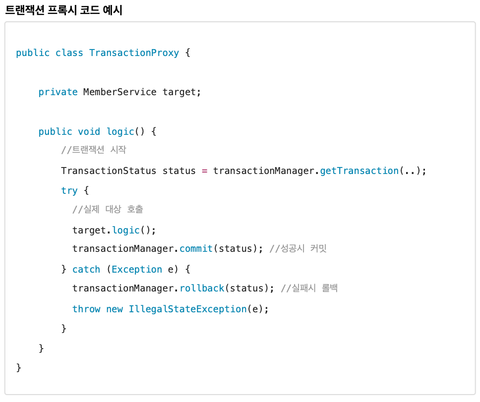      
>> 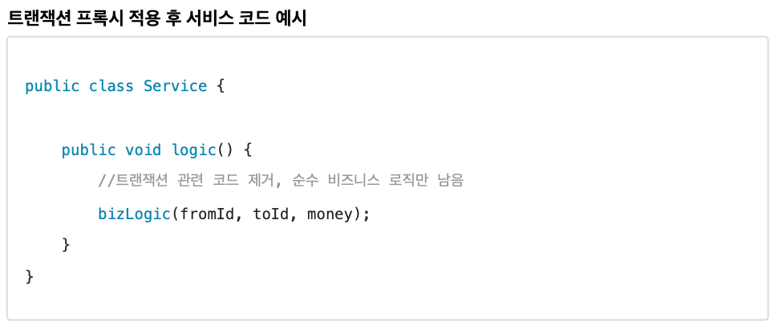       
>>        
>> - 프록시 도입 전 : 서비스에 비즈니스 로직과 트랜잭션 처리 로직이 함께 섞여있습니다.
>> - 프록시 도입 후 : 트랜잭션 프록시가 트랜잭션 처리 로직을 모두 가져갑니다. 그리고 트랜잭션을 시작한 후에 실제 서비스를 대신 호출합니다. 트랜잭션 프록시 덕분에 서비스 계층에는 순수한 비즈니스 로직만 남길 수 있습니다.
>>       
>> #### 스프링이 제공하는 트랜잭션 AOP
>> 스프링이 제공하는 AOP 기능을 사용하면 프록시를 매우 편리하게 적용할 수 있습니다.     
>> 물론 스프링 AOP를 직접 사용해서 트랜잭션을 처리해도 되지만, 트랜잭션은 매우 중요한 기능이고, 전세계 누구나 다 사용하는 기능입니다. 스프링은 트랜잭션 AOP를 처리하기 위한 모든 기능을 제공합니다. 스프링 부트를 사용하면 트랜잭션 AOP를 처리하기 위해 필요한 스프링 빈들도 자동으로 등록해줍니다.      
>> 개발자는 트랜잭션 처리가 필요한 곳이 <code>@Transactional</code> 애노테이션만 붙여주면 됩니다. 스프링의 트랜잭션 AOP는 이 애노테이션을 인식해서 트랜잭션 프록시를 적용해줍니다.         
>>         
>> @Transactional  
>> <code>org.springframework.transaction.annotation.Transactional</code>         
>>         
>> ※ 참고 : 스프링 AOP를 적용하려면 어드바이저, 포인트컷, 어드바이스가 필요합니다. 스프링은 트랜잭션 AOOP 처리를 위해 다음 클래스를 제공합니다. 스프링 부트를 사용하면 해당 빈들은 스프링 컨테이너에 자동으로 등록됩니다.     
>>      
>> - 어드바이저 : <code>BeanFactoryTransactionAttributeSourceAdvisor</code>
>> - 포인트컷 : <code>TransactionAttributeSourcePointcut</code>
>> - 어드바이스 : <code>TransactionInterceptor</code>          
>>        
>> #### 트랜잭션 AOP 정리    
>> 트랜잭션 AOP 적용 전체 흐름 정리
>> 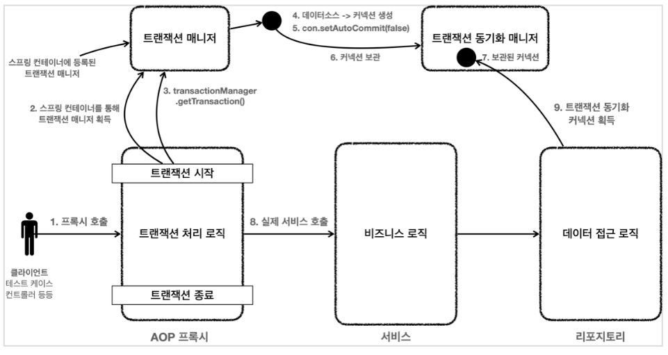     
>>       
>> 선언적 트랜잭션 관리 vs 프로그래밍 방식 트랜잭션 관리     
>> - 선언적 트랜잭션 관리(Declarative Transaction Management)
>>   - <code>@Transactional</code> 애노테이션 하나만 선언해서 매우 편리하게 트랜잭션을 적용하는 것을 선언적 트랜잭션 관리라고 합니다.
>>   - 선언적 트랜잭션 관리는 과거 XML에 설정하기도 했습니다. 이름 그대로 해당 로직에 트랜잭션을 적용하겠다 라고 어딘가에 선언하기만 하면 트랜잭션이 적용되는 방식입니다.
>> - 프로그래밍 방식의 트랜잭션 관리(programmatic transaction management)
>>   - 트랜잭션 매니저 또는 트랜잭션 템플릿 등을 사용해서 트랜잭션 관련 코드를 직접 작성하는 것을 프로그래밍 방식의 트랜잭션 관리라합니다.       
>>       
>> - 선언적 트랜잭션 관리가 프로그래밍 트랜잭션 관리에 비해 훨씬 간편하고 실용적이기 때문에 실무에서는 대부분 선언적 트랜잭션 관리를 사용합니다.
>> - 프로그래밍 방식의 트랜잭션 관리는 스프링 컨테이너나 스프링 AOP 기술 없이 간단히 사용할 수 있지만 실무에서는 대부분 스프링 컨테이너와 스프링 AOP를 사용하기 때문에 거의 사용되지 않습니다.     
>> - 프로그래밍 방식 트랜잭션 관리는 테스트 시에 가끔 사용될 때는 있습니다.       
>>        
>> 정리       
>> - 스프링이 제공하는 선언적 트랜잭션 관리 덕분에 드디어 트랜잭션 관련 코드를 순수한 비즈니스 로직에서 제거할 수 있었습니다.
>> - 개발자는 트랜잭션이 필요한 곳에 <code>@Transactional</code> 애노테이션 하나만 추가하면 됩니다. 나머지는 스프링 트랜잭션 AOP가 자동으로 처리해줍니다.     
>>    
>> #### 스프링 부트의 자동 리소스 등록
>> 스프링 부트가 등장하기 이전에는 데이터소스와 트랜잭션 매니저를 개발자가 직접 스프링 빈으로 등록해서 사용했습니다. 그런데 스프링 부트로 개발을 시작한 개발자라면, 데이터소스나 트랜잭션 매니저를 직접 등록한 적이 없을 것입니다.      
>> 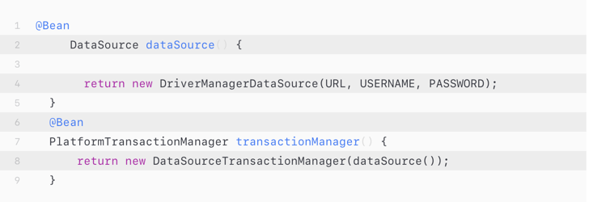     
>> 기존에는 이렇게 데이터소스와 트랜잭션 매니저를 직접 스프링 빈으로 등록해야했습니다.    
>> 그런데 스프링 부트가 나오면서 많은 부분이 자동화되었습니다.(더 오래전에는 스프링을 다루어왔다면, 해당 부분을 주로 XML로 등록하고 관리했을 것입니다.)  
>>       
>> 데이터소스 - 자동 등록        
>> - 스프링 부트는 데이터소스(<code>DataSource</code>)를 스프링 빈에 자동으로 등록합니다.
>> - 자동으로 등록되는 스프링 빈 이름 : <code>dataSource</code>
>> - 참고로 개발자가 직접 데이터소스를 빈으로 등록하면 스프링 부트는 데이터 소스를 자동으로 등록하지 않습니다.      
>>       
>> 이떄 스프링 부트는 다음과 같이 <code>application.properties</code>에 있는 속성을 사용해서 <code>DataSource</code>를 생성합니다. 그리고 스프링 빈에 등록합니다.        
>>       
>>        
>> - 스프링 부트가 기본으로 생성하는 데이터소스는 커넥션풀을 제공하는 <code>HikariDataSource</code>입니다. 커넥션풀과 관련된 설정도 <code>application.properties</code>를 통해서 지정할 수 있습니다. 
>> - <code>spring.datasource.url</code> 속성이 없으면 내장 데이터베이스(메모리 DB)를 생성하려고 시도합니다.    
>> 
>> 트랜잭션 매니저 - 자동 등록      
- 스프링 부트는 적절한 트랜잭션 매니저(<code>PlatformTransactionManager</code>)를 자동으로 스프링 빈에 등록합니다.    
- 자동으로 등록되는 스프링 빈 이름 : <code>transactionManager</code>      
- 참고로 개발자가 직접 트랜잭션 매니저를 빈으로 등록하면 스프링 부트는 트랜잭션 매니저를 자동으로 등록하지 않습니다.     
>>     
>> 어떤 트랜잭션 매니저를 선택할지는 현재 등록된 라이브러리를 보고 판단하는데, JDBC를 기술로 사용하면 <code>DataSourceTransactionManager</code>를 빈으로 등록하고, JPA를 사용하면 <code>JpaTransactionManager</code>를 등록합니다.    
>> 둘 다 사용하는 경우 <code>JpaTransactionManager를 등록합니다.</code>
>> 참고로 <code>JpaTransactionManager</code>는 <code>DataSourceTransactionManager</code>가 제공하는 기능도 대부분 지원합니다.    
>>      
>> 정리     
>> - 데이터소스와 트랜잭션 매니저는 스프링 부트가 제공하는 자동 빈 등록 기능을 사용하는 것이 편리합니다.   
>> - 추가로 <code>application.properties</code>를 통해 설정도 편리하게 할 수 있습니다.       
>>    
>> 스프링 부트의 데이터 소스 자동 등록에 대한 더 자세한 내용은 다음 스프링 부트 공식 메뉴얼을 참고하면됩니다.    
>> https://docs.spring.io/spring-boot/docs/current/reference/html/data.html#data.sql.datasource.production
>> 
> 
>
>> #### 자바 예외 이해
>> 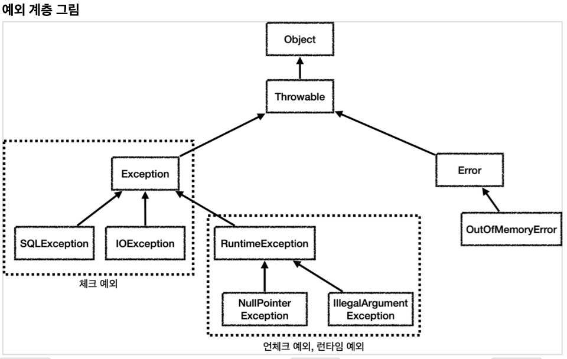      
>>      
>> #### 예외 기본 규칙   
>> 예외는 잡아서 처리하거나, 처리할 수 없으면 밖으로 던져야 합니다.      
>> 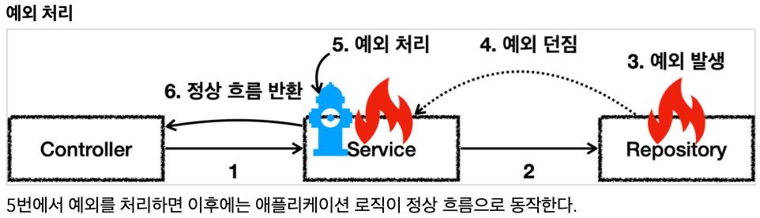     
>> 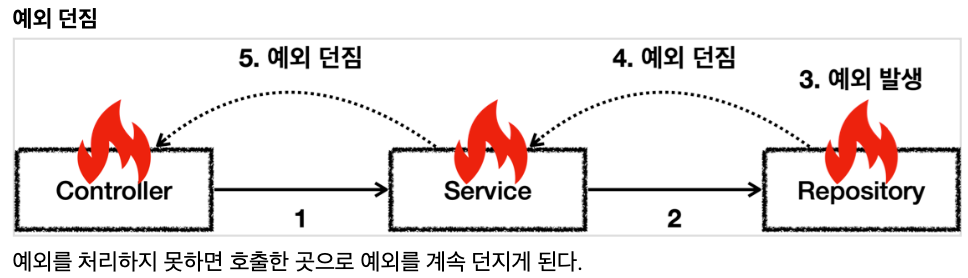      
>> 예외에 대해서는 2가지 기본 규칙을 기억해야합니다.    
>> 1. 예외는 잡아서 처리하거나 던져야 한다.
>> 2. 예외를 잡거나 던질 때 지정한 예외 뿐만 아니라 그 예외의 자식들도 함께 처리된다.
>>    1. 예를 들어 <code>Exception</code>을 <code>catch</code>로 잡으면 그 하위 예외들도 모두 잡을 수 있습니다.
>>    2. 예를 들어 <code>Exception</code>을 <code>throws</code>로 던지면 그 하위 예외들도 모두 던질 수 있습니다.     
>>      
>> 참고 : 예외를 처리하지 못하고 계속 던지면 어떻게 될까요?   
>> - 자바 <code>main()</code> 쓰레드의 경우 예외 로그를 출력하면서 시스템이 종료됩니다.   
>> - 웹 어플리케이션의 경우 여러 사용자의 요청을 처리하기 때문에 하나의 예외 때문에 시스템이 종료되면 안됩니다. WAS가 해당 예외를 받아서 처리하는데, 주로 개발자가 지정한, 오류 페이지를 보여줍니다.        
>>      
>> #### 체크 예외의 장단점
> 체크 예외는 예외를 잡아서 처리할 수 없을 때, 예외를 밖으로 던지는 <code>throws</code>를 필수로 선언해야합니다. 그렇지 않으면 컴파일 오류가 발생합니다. 이것 때문에 장점과 단점이 동시에 존재합니다.
>> - 장점 : 개발자가 실수로 예외를 누락하지 않도록 컴파일러를 통해 문제를 잡아주는 훌륭한 안전 장치입니다.
>> - 단점 : 하지만 실제로 개발자가 모든 체크 예외를 반드시 잡거나 던지도록 처리해야 하기 때문에, 너무 번거로운 일이 됩니다. 크게 신경쓰고 싶지 않은 예외까지 모두 챙겨야합니다. 추가로 의존관계에 따른 단점도 있습니다.
>>   
>> #### 언체크 예외의 장단점
>>  언체크 예외는 예외를 잡아서 처리할 수 없을 때, 예외를 밖으로 던지는 <code>throws 예외</code>를 생략할 수 있습니다. 이것 때문에 장점과 단점이 동시에 존재합니다.    
>> - 장점 : 신경쓰고 싶지 않은 언체크 예외를 무시할 수 있습니다. 체크 예외의 경우 처리할 수 없는 예외를 밖으로 던지려면 항상 <code>throws 예외</code> 를 선언해야 하지만, 언체크 예외는 이 부분을 생략할 수 있습니다. 그리고 신경쓰고 싶지 않은 예외는 의존관계를 참조하지 않아도 되는 장점이 있습니다.
>> - 단점 : 언체크 예외는 개발자가 실수로 예외를 누락할 수 있습니다. 반면에 체크 예외는 컴파일러를 통해 예외 누락을 잡아줍니다.     
>>     
>> 정리     
>> 체크 예외와 언체크 예외의 차이는 사실 예외를 처리할 수 없을 때 예외를 밖으로 던지는 부분에 있습니다. 이 부분을 필수로 선언해야 하는가 생략할 수 있는가의 차이입니다.       
>>        
>> 그렇다면 언제 체크 예외를 사용하고, 언제 언체크(런타임) 예외를 사용하면 좋을까요?   
>     
> 기본 원칙은 다음 2가지를 기억하면됩니다.    
>> - 기본적으로 언체크(런타임) 예외를 사용해야합니다.   
>> - 체크 예외는 비즈니스 로직상 의도적으로 던지는 예외에만 사용해야합니다.
>>   - 이 경우 해당 예외를 잡아서 반드시 처리해야 하는 문제일 때만 체크 예외를 사용해야합니다. 예를 들어서 다음과 같은 경우가 있습니다.
>>   - 체크 예외 예)
>>     - 계좌 이체 실패 예외
>>     - 결제시 포인트 부족 예외
>>     - 로그인 ID, PW 불일치 예외
>>   - 물론 이 경우도 100% 체크 예외로 만들어야 하는 것은 아닙니다. 다만 계좌 이체 실패처럼 매우 심각한 문제는 개발자가 실수로 예외를 놓치면 안된다고 판단할 수 있습니다. 이 경우 체크 예외로 만들어 두면 컴파일러를 통해 놓친 예외를 인지할 수 있습니다.   
>>      
>> 체크 예외를 기본으로 사용하면 발생할 수 있는 문제      
>> 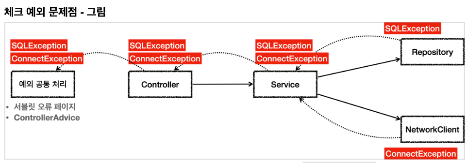     
>> 1. 복구 불가능한 예외
>>    1. <code>SQLException</code>을 예로 들면 DB에 무언가 문제가 있어서 발생하는 예외입니다. 이런 문제들은 대부분 복구가 불가능합니다. 특히나 대부분의 서비스나 컨트롤러는 이런 문제를 해결할 수 없습니다. 따라서 이런 문제들은 일관성 있게 공통으로 처리해야 합니다. 오류 로그를 남기고 개발자가 해당 오류를 빠르게 인지하는 것이 필요합니다. 서블릿 필터, 스프링 인터셉터, 스프링의 <code>ControllerAdvice</code>를 사용하면 이런 부분을 깔끔하게 공통으로 해결할 수 있습니다.
>> 2. 의존 관계에 대하 문제
>>    1. 앞서 대부분의 예외는 복구 불가능한 예외라고 했습니다. 그런데 체크 예외를 사용하면 컨트롤러나 서비스 입장에서는 본인이 처리할 수 없어도 어쩔 수 없이 <code>throws</code>를 통해 던지는 예외를 선언해야합니다.   
>>      
>> 그렇게 되면 아래와 같이 추가적인 문제가 발생합니다.   
>>   
>> 체크 예외 구현 기술 변경시 파급 효과 
>> 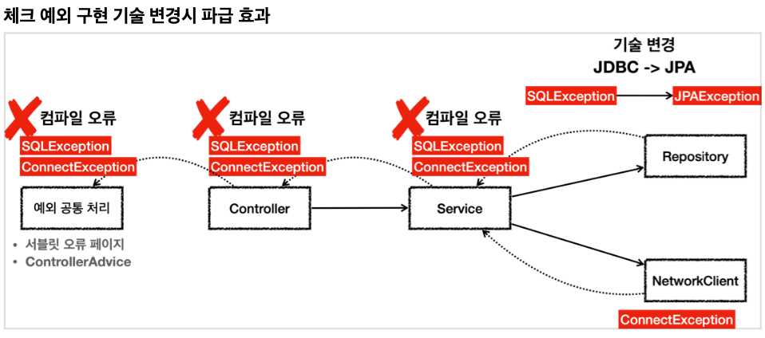   
>> JDBC → JPA 같은 기술로 변경하면 예외도 함께 변경해야합니다. 그리고 해당 예외를 던지는 모든 부분도 함께 변경해야합니다.     
>>     
>> 정리     
>> 처리할 수 있는 체크 예외라면 서비스나 컨트롤러에서 처리하겠지만, 지금처럼 데이터베이스나 네트워크 통신처럼 시스템 레벨에서 올라온 예외들은 대부분 복구가 불가능합니다. 그리고 실무에서 발생하는 대부분의 예외들은 이런 시스템 예외들입니다. 
>> 이런 경우에 체크 예외를 사용하면 아래에서 올라온 복구 불가능한 예외를 서비스, 컨트롤러 같은 각각의 클래스가 모두 알고 있어야 합니다. 그래서 불필요한 의존관계 문제가 발생합니다.      
>>       
>> 언체크 예외 사용시
>> 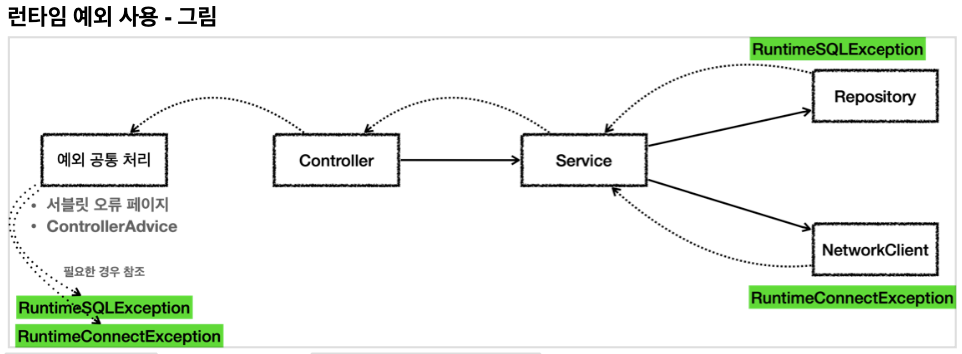     
>> - <code>SQLException</code>을 런타임 예외인 <code>RuntimeSQLException</code> 으로 변환했습니다.   
>> - <code>ConnectException</code> 대신에 <code>RuntimeConnectException</code>을 사용하도록 바꾸었습니다.
>> - 런타임 예외이기 때문에 서비스, 컨트롤러는 해당 예외들을 처리할 수 없다면 별도의 선언 없이 그냥 두면 됩니다.     
>>   
>> 런타임 예외 구현 기술 변경시 파급 효과
>> 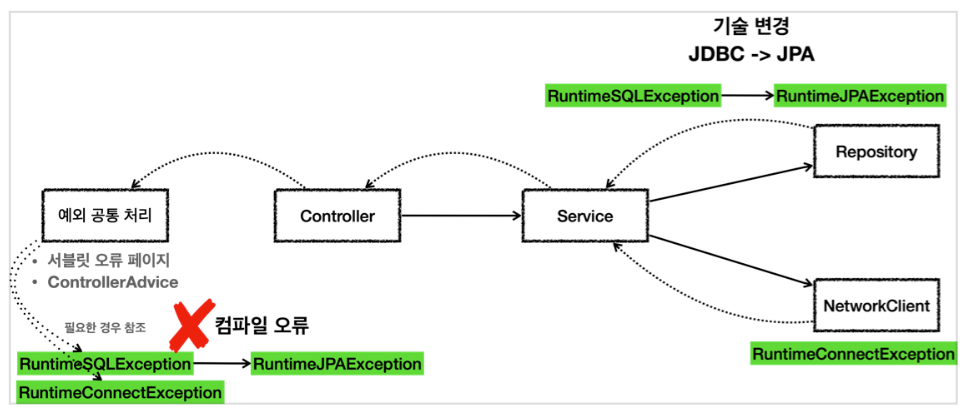        
>> 런타임 예외를 사용하면 중간에 기술이 변경되어도 해당 예외를 사용하지 않는 컨트롤러, 서비스에서는 코드를 변경하지 않아도 됩니다.     
>> 구현 기술이 변경되는 경우, 예외를 공통으로 처리하는 곳에서 예외에 따른 다른 처리가 필요할 수 있습니다. 하지만 공통 처리하는 한곳만 변경하면 되기 떄문에 변경의 영향 범위는 최소화 됩니다.      
>>       
>> 정리
>> 처음 자바를 설계할 당시에는 체크 예외가 더 나은 선택이라고 생각했습니다. 그래서 자바가 기본으로 제공하는 기능들에는 체크 예외가 많습니다. 그런데 시간이 흐르면서 복구할 수 없는 예외가 너무 많아졌습니다. 특히 라이브러리를 점점 더 많이 사용하면서 처리해야하는 예외도 더 늘어났습니다. 체크 예외는 해당 라이브러리들이 제공하는 모든 예외를 처리할 수 없을 떄마다 <code>throws</code>에 예외를 덕지덕지 붙여야 했습니다.   
>> 그래서 개발자들은 <code>throws Exception</code>이라는 극단적(?)인 방법도 자주 사용했었다고 합니다.   
>> 물론 이 방법은 사용하면 안됩니다. 모든 예외를 던진다고 선언하는 것인데, 결과적으로 어떤 예외를 잡고 어떤 예외를 던지는지 알 수 없기 때문입니다. 체크 예외를 사용한다면 잡을 건 잡고 던질 예외는 명확하게 던지도록 선언해야합니다.     
>>     
>> 체크 예외의 이런 문제점 때문에 최근 라이브러리들은 대부분 런타임 예외를 기본으로 제공합니다.   
>> 사실 위에서 알아본 JPA 기술도 런타임 예외를 사용합니다. 스프링도 대부분 런타임 예외를 제공합니다.   
>> 런타임 예외도 필요하면 잡을 수 있기 때문에 필요한 경우에는 잡아서 처리하고, 그렇지 않으면 자연스럽게 던지도록 둡니다.     
>> 그리고 예외를 공통으로 처리하는 부분을 앞에 만들어서 처리하면 됩니다.      
>>      
>> 추가로 런타임 예외는 놓칠 수 있기 때문에 문서화가 중요합니다.      
>>    
>> 런타임 예외는 문서화
>> - 런타임 예외는 문서화를 잘해야합니다. 
>> - 또는 코드에 <code>throws 런타임예외</code>를 남겨서 중요한 예외를 인지할 수 있게 해줘야합니다.       
>>       
>> #### 예외 포함과 스택 트레이스     
>> 예외를 전환할 때는 꼭! 기존 예욀르 포함 해야합니다. 그렇지 않으면 스택 트레이스를 확인할 때 심각한 문제가 발생합니다.     
>> 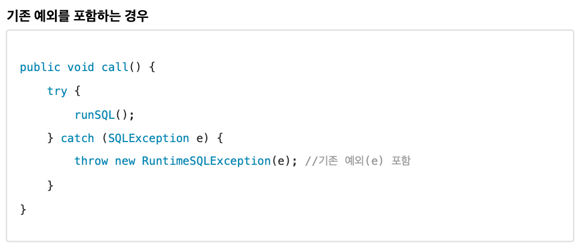     
>> 이렇게 예외를 전환할 때는 기존 예외를 꼭 포함해야, 예외를 포함해서 기존에 발생한 예외를 스택 트레이스로 확인할 수 있습니다.   
>> 예외를 전환할 때는 꼭! 기존 예외를 포함해야합니다.
>
>> #### 스프링과 문제 해결 - 예외 처리, 반복        
>> 
> --------------------     
> 앞서 스프링 MVC 공부를 통해 클라이언트의 요청을 받아서 처리하는 방법을 학습했고,    
> 이번에는 그 이후 단계인 비즈니스 로직을 수행하는 서비스와 수행 결과를 데이터베이스에 보관하고 관리하는 레포지토리에 대해 깊이있게 학습했습니다.    
>           
> 먼저, 스프링 없이 순수한 데이터 접근 기술인 JDBC, 커넥션, 커넥션 풀, 데이터소스, 트랜잭션 같은 기반 기술의 핵심 개념을 먼저 학습했습니다.   
> 이렇게 기반을 다진 다음에, 그 위헤 스프링 데이터 접근 기술이 이 기능들을 얼마나 편리하게 사용할 수 있도록 도와주는지 단계별로 깊이있게 학습했습니다.    
> 과거에 어떤 불편한 점이 있어서 다음 기술이 탄생했고, 어떤 점들이 개선되었는지 그 이유를 직접 코딩하며 이해하게 되었습니다.

>  