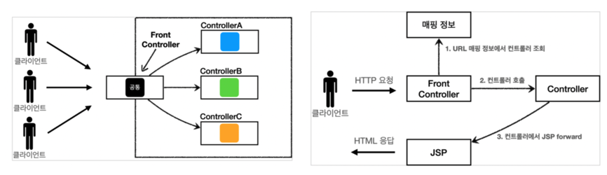
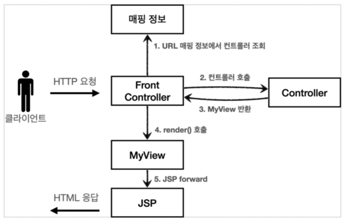
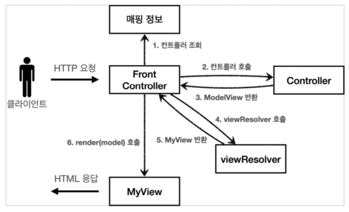
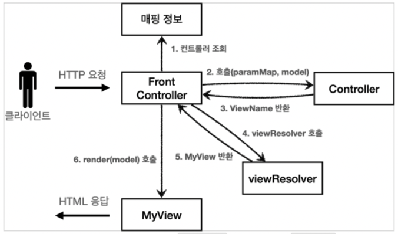
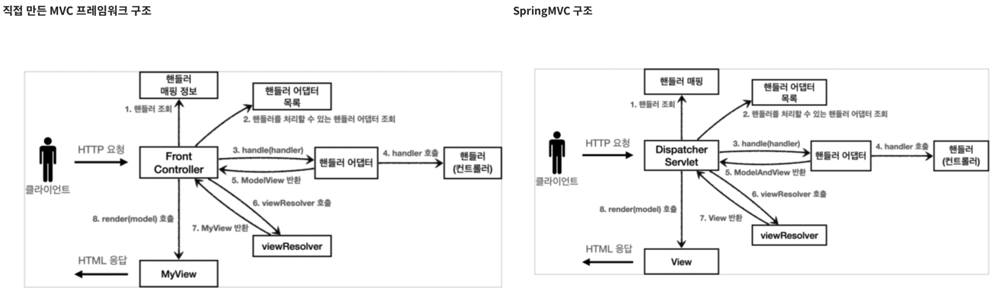
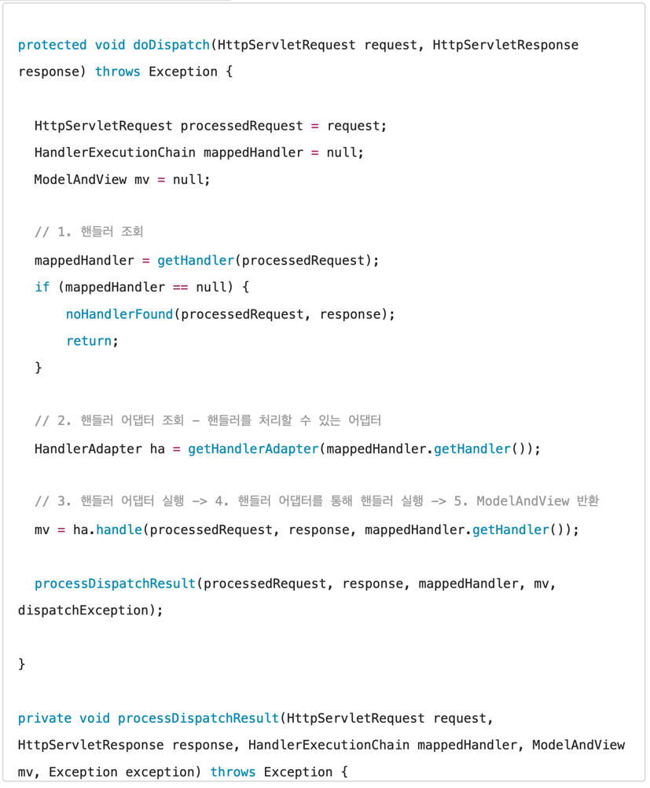
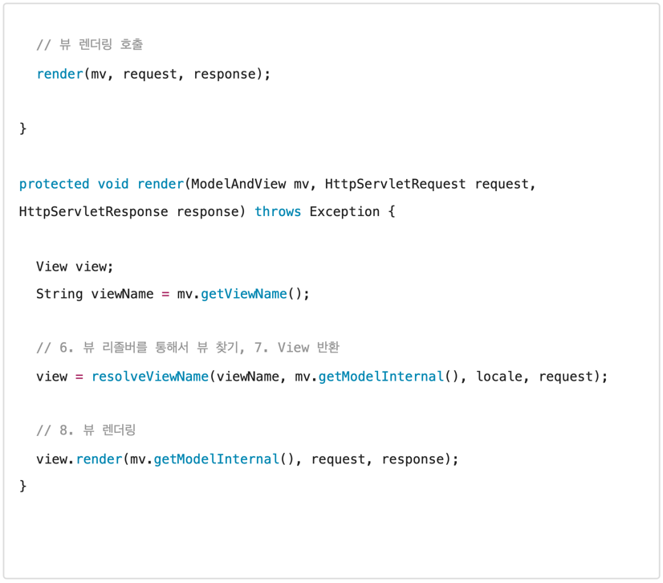
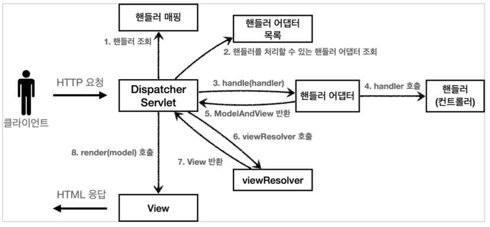
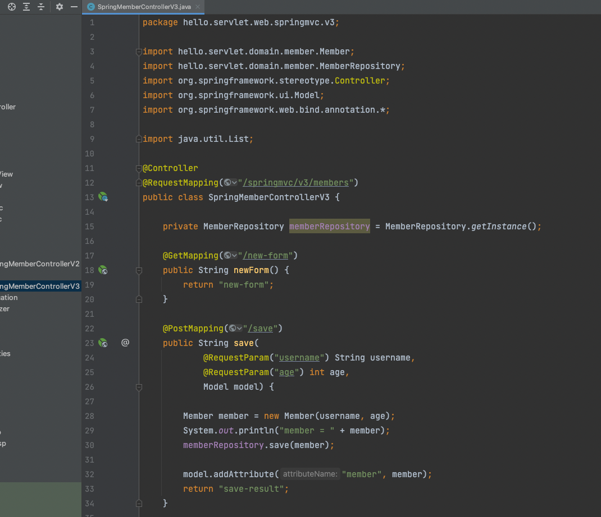
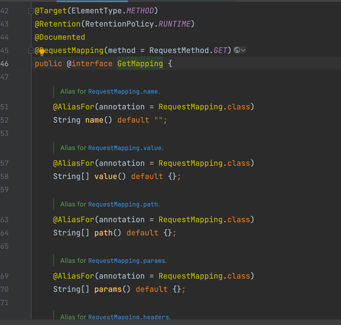

# Spring_MVC1
>### Spring_MVC1 레포지토리의 목표는,
> 스프링 없이 직접 스프링 MVC의 핵심 기능을 만들어보는 과정을 통해   
> 스프링 MVC의 내부 구조가 왜 이렇게 설계되었는지 깊이있게 이해하는 것 입니다.
>
> 자바 웹 기술의 기초라 할 수 있는 서블릿부터 시작해서 JSP, MVC패턴, MVC 프레임워크, 
> 그리고 스프링 MVC의 탄생부터 실무에서 주로 사용하는 스프링 MVC의 사용법까지,    
> 모든 것을 코드로 만들어보면서 단계적으로 알아갈 것입니다.    
> 
> 과거에 어떤 불편한 점이 있어서 다음 기술이 탄생했고, 어떤 점들이 개선되었는지   
> 그 이유를 직접 코딩하면서 자연스럽게 이해할 것 입니다.

---
## Index
### 웹 애플리케이션 이해
- [웹 서버, 웹 애플리케이션 서버](https://mgyo.tistory.com/534)
- [서블릿](https://mgyo.tistory.com/535)
- [동시 요청 - 멀티 쓰레드](https://mgyo.tistory.com/537)
- [HTML, HTTP API, CSR, SSR](https://mgyo.tistory.com/538)
- [자바 백엔드 웹 기술 역사](https://mgyo.tistory.com/539)

### 서블릿
- [프로젝트 생성](https://mgyo.tistory.com/540)
- [Hello 서블릿](https://mgyo.tistory.com/541)
- [HttpServletRequest - 개요](https://mgyo.tistory.com/542)
- [HttpServletRequest- 기본 사용법](https://mgyo.tistory.com/543)
- [HTTP 요청 데이터 - 개요](https://mgyo.tistory.com/544)
- [HTTP 요청 데이터 - GET 쿼리 파라미터](https://mgyo.tistory.com/545)
- [HTTP 요청 데이터 - POST HTML Form](https://mgyo.tistory.com/546)
- [HTTP 요청 데이터 - API 메시지 바디 - 단순 텍스트](https://mgyo.tistory.com/548)
- [HTTP 요청 데이터 - API 메시지 바디 - JSON](https://mgyo.tistory.com/549)
- [HttpServletResponse - 기본 사용법](https://mgyo.tistory.com/550)
- [HTTP 응답 데이터 - 단순 텍스트, HTML](https://mgyo.tistory.com/552)
- [HTTP 응답 데이터 - API JSON](https://mgyo.tistory.com/553)
- [정리](https://mgyo.tistory.com/554)

### 서블릿, JSP, MVC 패턴
- [회원 관리 웹 애플리케이션 요구사항](https://mgyo.tistory.com/555)
- [서블릿으로 회원 관리 웹 애플리케이션 만들기](https://mgyo.tistory.com/556)
- [JSP로 회원 관리 웹 애플리케이션 만들기](https://mgyo.tistory.com/557)
- [MVC 패턴 - 개요](https://mgyo.tistory.com/558)
- [MVC 패턴 - 적용](https://mgyo.tistory.com/560)
- [MVC 패턴 - 한계](https://mgyo.tistory.com/562)
- [정리](https://mgyo.tistory.com/563)

### MVC 프레임워크 만들기
- [프론트 컨트롤러 패턴 소개](https://mgyo.tistory.com/564)
- [프론트 컨트롤러 도입 - v1](https://mgyo.tistory.com/565)
- [View 분리 - v2](https://mgyo.tistory.com/566)
- [Model 추가 - v3](https://mgyo.tistory.com/567)
- [단순하고 실용적인 컨트롤러 - v4](https://mgyo.tistory.com/569)
- [유연한 컨트롤러1 - v5](https://mgyo.tistory.com/570)
- [유연한 컨트롤러2 - v5](https://mgyo.tistory.com/572)
- [정리](https://mgyo.tistory.com/573)

### 스프링 MVC - 구조 이해
- [스프링 MVC 전체 구조](https://mgyo.tistory.com/575)
- [핸들러 매핑과 핸들러 어댑터](https://mgyo.tistory.com/576)
- [뷰 리졸버](https://mgyo.tistory.com/577)
- [스프링 MVC - 시작하기](https://mgyo.tistory.com/578)
- [스프링 MVC - 컨트롤러 통합](https://mgyo.tistory.com/579)
- [스프링 MVC - 실용적인 방식](https://mgyo.tistory.com/580)
- [정리](https://mgyo.tistory.com/581)

### 스프링 MVC - 기본 기능
- [프로젝트 생성](https://mgyo.tistory.com/582)
- [로깅 간단히 알아보기](https://mgyo.tistory.com/583)
- [요청 매핑](https://mgyo.tistory.com/584)
- [요청 매핑 - API 예시](https://mgyo.tistory.com/585)
- [HTTP 요청 - 기본, 헤더 조회](https://mgyo.tistory.com/586)
- [HTTP 요청 파라미터 - 쿼리 파라미터, HTML Form](https://mgyo.tistory.com/587)
- [HTTP 요청 파라미터 - @RequestParam](https://mgyo.tistory.com/588)
- [HTTP 요청 파라미터 - @ModelAttribute](https://mgyo.tistory.com/589)
- [HTTP 요청 메시지 - 단순 텍스트](https://mgyo.tistory.com/590)
- [HTTP 요청 메시지 - JSON](https://mgyo.tistory.com/591)
- [응답 - 정적 리소스, 뷰 템플릿](https://mgyo.tistory.com/592)
- [HTTP 응답 - HTTP API, 메시지 바디에 직접 입력](https://mgyo.tistory.com/593)
- [HTTP 메시지 컨버터](https://mgyo.tistory.com/594)
- [요청 매핑 핸들러 어댑터 구조](https://mgyo.tistory.com/595)
- [정리](https://mgyo.tistory.com/596)

### 스프링 MVC - 웹 페이지 만들기
- [프로젝트 생성](https://mgyo.tistory.com/597)
- [요구사항 분석](https://mgyo.tistory.com/598)
- [상품 도메인 개발](https://mgyo.tistory.com/599)
- [상품 서비스 HTML](https://mgyo.tistory.com/600)
- [상품 목록 - 타임리프](https://mgyo.tistory.com/601)
- [상품 상세](https://mgyo.tistory.com/604)
- [상품 등록 폼](https://mgyo.tistory.com/605)
- [상품 등록 처리 - @ModelAttribute](https://mgyo.tistory.com/606)
- [상품 수정](https://mgyo.tistory.com/609)
- [PRG Post/Redirect/Get](https://mgyo.tistory.com/610)
- [RedirectAttributes](https://mgyo.tistory.com/611)
- [정리](https://mgyo.tistory.com/612)

[Spring_MVC1을 마치며..](#마무리)

### 마무리
> Spring_MVC1 레포지토리의 목표는,    
> 스프링 없이 직접 스프링 MVC의 핵심 기능을 만들어보는 과정을 통해   
> 스프링 MVC의 내부 구조가 왜 이렇게 설계되었는지 깊이있게 이해하는 것 이었습니다.
>
> 자바 웹 기술의 기초라 할 수 있는 서블릿부터 시작해서 JSP, MVC패턴, MVC 프레임워크,
> 그리고 스프링 MVC의 탄생부터 실무에서 주로 사용하는 스프링 MVC의 사용법까지,
> 모든 것을 코드로 만들어보면서 단계적으로 알아보았습니다.
>
> 
>
> - 웹 애플리케이션 이해
> - 서블릿
> - 서블릿, JSP, MVC 패턴
> - MVC 프레임워크 만들기
> - 스프링 MVC - 구조 이해
> - 스프링 MVC - 기본 기능
> - 스프링 MVC - 웹 페이지 만들기
>
> ### 요약 및 정리   
> 이 레포지토리에서는,v1 ~ v5 로 점진적으로 프레임워크를 발전시켜 왔습니다.    
> 지금까지 한 작업을 정리해보겠습니다.   
>     
>> #### v1 : 프론트 컨트롤러를 도입    
>> 
>> - 기존 구조를 최대한 유지하면서 프론트 컨트롤러를 도입 
>>        
>> v1에서는 프론트 컨트롤러를 단순하게 도입했습니다.
>    
>> #### v2 : View 분류   
>> 
>> - 단순 반복되는 뷰 로직 분리        
>>      
>> 반복되는 view때문에 view를 분리했습니다. 
>     
>>  #### v3 : Model 추가   
>> 
>> - 서블릿 종속성 제거   
>> - 뷰 이름 중복 제거         
>>      
>> FrontController가 Controller를 호출하고, ModelAndView를 반환 받았습니다. 그리고 논리적인 이름을 사용했습니다.   
>> 그리고 실제로 물리적인 이름과 MyView를 생성해서 반환해 주는 것은 ViewResolver가 하도록 했습니다.    
>> 이렇게 하면, 나중에 view에 대한 구체적인 것들이 변경되어도 viewResolver와 관련된 설정만 바꿔주면 됩니다.
>     
>> #### v4 : 단순하고 실용적인 컨트롤러     
>> 
>> - v3와 거의 비슷   
>> - 구현 입장에서 ModelView를 직접 생성해서 반환하지 않도록 편리한 인터페이스 제공     
>>    
>> ModelView를 반환 해야하다보니, 개발하는 입장에서는 너무 번거로웠습니다.   
>> 그래서 Controller에서는 ViewName을 반환하도록 하고,   
>> model도 FrontController에서 반환하도록 넘겨줬습니다.   
>      
>> #### v5 : 유연한 컨트롤러     
>> 
>> - 어댑터 도입
>> - 어댑터를 추가해서 프레임워크를 유연하고 확장성 있게 설계         
>>        
>> v5에서는 v3, v4등 기능을 다른 방식으로 확장하고 싶은 경우를 위해 어댑터 개념을 도입했습니다.   
>> 그래서 매핑 정보에서 어댑터를 찾아서 가지고 오고,   
>> 어댑터를 통해서 컨트롤러가 호출됩니다.   
>> FrontController와 Controller가 서로 안맞지만, 중간에 어댑터가 다 맞춰주는 것 입니다.(modelView 반환하는 것도 전부 맞춰줍니다.)
>    
> 여기에 애노테이션을 사용해서 컨트롤러를 더 편리하게 발전시킬 수도 있습니다.    
> 만약 애노테이션을 사용해서 컨트롤러를 편리하게 사용할 수 있게 하려면 어떻게 해야할까요?   
> 바로 애노테이션을 지원하는 어댑터를 추가하면 됩니다.    
> 다형성과 어댑터 덕분에 기존 구조를 유지하면서, 프레임 워크의 기능을 확장할 수 있습니다.         
>      
>> #### 직접 만든 MVC 프레임워크 구조 vs SpringMVC 구조     
>>    
>> 직접 만든 프레임워크 → 스프링 MVC 비교   
>> - FrontController → DispatcherServlet
>> - handlerMappingMap → HandlerMapping
>> - MyHandlerAdapter → HandlerAdapter
>> - ModelView → ModelAndView
>> - viewResolver → ViewResolver
>> - MyView → View
>>     
>> #### DispatcherServlet 구조 살펴보기
>> <code>org.springframework.web.servlet.DispatcherServlet</code>    
>> 스프링 MVC도 프론트 컨트롤러 패턴으로 구현되어 있습니다.   
>> 스프링 MVC의 프론트 컨트롤러가 바로 디스패처 서블릿(DispatcherServlet)입니다.   
>> 그리고 이 디스패처 서블릿이 바로 스프링 MVC의 핵심입니다.   
>>   
>> #### DispatcherSevlet 서블릿 등록   
>> - DispatcherServlet 도 부모 클래스에서 HttpServlet을 상속 받아서 사용하고, 서블릿으로 동작합니다.
>>  - DispatcherServlet → FrameworkServlet → HttpServletBean → HttpServlet
>> - 스프링 부트는 DispatcherServlet을 서블릿으로 자동 등록하면서 모든 경로(urlPatterns="/")에 대해서 매핑합니다.
>>  - 참고 : 더 자세한 경로가 우선순위가 높습니다. 그래서 기존에 등록한 서블릿도 함께 동작합니다.
>>     
>> #### 요청 흐름
>> - 서블릿이 호출되면 HttpServlet이 제공하는 service()가 호출됩니다.   
>> - 스프링 MVC는 DispatcherServlet의 부모인 FrameworkServlet에서 service()를 오버라이드 해두었습니다.
>> - FrameworkServlet.service()를 시작으로 여러 메서드가 호출되면서 DispatcherServlet.doDispatch()가 호출됩니다.
>     
>> 이번에는 DispatcherServlet의 핵심인 doDispatch() 코드를 분석 해보겠습니다.     
>> 최대한 간단하게 정리하기 위해 예외처리, 인터셉터 기능은 제외했습니다.   
>> #### DispatcherServlet.doDispatch()    
>>     
>>      
>        
>> #### SpringMVC 구조   
>>        
>> 동작 순서   
>> 1. 핸들러 조회 : 핸들러 매핑을 통해 요청 URL에 매핑된 핸들러(컨트롤러)를 조회한다.
>> 2. 핸들러 어댑터 조회 : 핸들러를 실행할 수 있는 핸들러 어댑터를 조회한다.
>> 3. 핸들러 어댑터 실행 : 핸들러 어댑터를 실행한다.   
>> 4. 핸들러 실행 : 핸들러 어댑터가 실제 핸들러를 실행한다.
>> 5. ModelAndView 반환 : 핸들러 어댑터는 핸들러가 반환하는 정보를 ModelAndView로 변환해서 반환한다.
>> 6. viewResolver 호출 : 뷰 리졸버를 찾고 실행한다.
>>   1. JSP의 경우 : InternalResourceViewResolver가 자동 등록되고, 사용된다.
>> 7. View 반환 : 뷰 리졸버는 뷰의 논리 이름을 물리 이름으로 바꾸고, 랜더링 역할을 담당하는 뷰 객체를 반환한다.
>>   1. JSP의 경우 InternalResourceView(JslView)를 반환하는데, 내부에 forward() 로직이 있다.
>> 8. 뷰 랜더링 : 뷰를 통해서 뷰를 랜더링 한다.
>>        
>> 스프링 MVC의 큰 강점은 DispatcherServlet 코드의 변경 없이, 원하는 기능을 변경하거나 확장할 수 있다는 점입니다.    
>> 지금까지 알아본 대부분의 것들을 확장 가능할 수 있도록 인터페이스로 제공합니다.   
>> 이 인터페이스들만 구현해서 DispatcherServlet에 등록하면 우리들만의 컨트롤러를 만들 수도 있습니다.   
>>     
>>  #### 주요 인터페이스 목록
>> 핸들러 매핑: <code>org.springframework.web.servlet.HandlerMapping</code>     
>> 핸들러 어댑터: <code>org.springframework.web.servlet.HandlerAdapter</code>      
>> 뷰 리졸버: <code>org.springframework.web.servlet.ViewResolver</code>        
>> 뷰: <code>org.springframework.web.servlet.View</code>        
>
>> #### 실무에서 주로 사용하는 방식
>> 
>> 
>> #### Model 파라미터
>> save(), members()를 보면, Model을 파라미터로 받는 것을 확인할 수 있습니다.    
>> 스프링 MVC 도 이런 편의 기능을 제공합니다.   
>>        
>> #### ViewName 직접 반환
>> 뷰의 논리 이름을 반환할 수 있습니다.    
>>          
>> #### @RequestParam 사용    
>> 스프링은 HTTP 요청 파라미터를 <code>@RequestParam</code>으로 받을 수 있습니다.     
>> <code>@RequestParam("usename")</code>은 <code>request.getParameter("username")</code>와 거의 같은 코드라고 생각하면 됩니다.   
>> 물론 GET 쿼리 파라미터, POST Form 방식을 모두 지원합니다.      
>>               
>> #### @RequestMapping → @GetMapping, @PostMapping    
>> <code>@RequestMapping</code>은 URL만 매칭하는 것이 아니라, HTTP Method도 함께 구분할 수 있습니다.    
>> 예를 들어서 URL이 /new-form이고, HTTP Method가 GET인 경우를 모두 만족하는 매핑을 하려면 다음과 같이 처리하면 됩니다.    
> <code>@RequestMapping(value = '/new-form", method = RequestMethod.GET) </code>         
>> 이것을 <code>@GetMapping</code>, <code>@PostMapping</code> 으로 더 편리하게 사용할 수 있습니다.             
> <code>@RequestMapping</code> 를 통해 클래스레벨, 메서드 레벨을 조합 할 수 있습니다.
>> 참고로 Get, Post, Delete, Patch 모두 애노테이션으로 준비되어 있습니다.                
>>         
>>            
> <Code>@GetMapping</code> 코드를 열어서 <code>@RequestMapping</code> 애노테이션을 내부에 가지고 있는 모습을 확인해 볼 수 있습니다.
> 
> ----
> 스프링을 이용해서 웹 어플리케이션을 개발하려면, 스프링 MVC의 핵심 구조를 제대로 파악해야 합니다.   
> 
> 그런데 스프링 MVC에는 수 많은 기능들이 자동화되고, 추상화되어 있기 떄문에 핵심 구조를 파악하기가 쉽지 않습니다.      
> 
> 그래서, 스프링 없이 직접 스프링 MVC의 핵심 기능을 만들어 보았습니다.    
> 단순히 머리로 MVC 프레임워크를 이해하는 것이 아니라, 완전히 처음부터 MVC 프레임워크를 새로 개발했습니다.      
> 
> 그리고 단계적으로 MVC 프레임워크를 발전시켜 나가는 과정을 통해 자연스럽게 스프링 MVC의 내부 구조가 왜 이렇게 설계되었는지 깊이있게 이해할 수 있었습니다.       
> 스프링 MVC는 전 세계 수 많은 개발자들의 요구사항에 맞추어 기능을 계속 확장해왔습니다. 그래서, 대부분의 기능이 이미 다 구현되어 있습니다.    
> 그래도, 이렇게 핵심 동작 방식을 알아두어야, 향후 문제가 발생했을 때 어떤 부분에서 문제가 발생했는지 쉽게 파악하고, 문제를 해결할 수 있습니다.  
> 그리고 확장 포인트가 필요할 때, 어떤 부분을 확장해야 할지 감을 잡을 수 있습니다.  